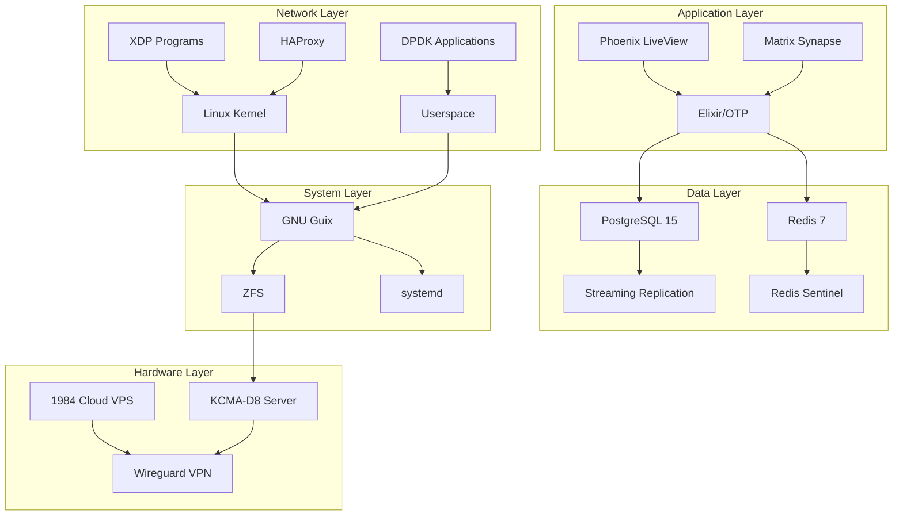

# Scaling FOSS Infrastructure: A Complete Guide to Building a Hybrid Cloud Platform with Elixir, Phoenix LiveView, Matrix, and High-Performance Networking

Building a truly scalable, privacy-respecting, and performance-oriented infrastructure using only Free and Open Source Software (FOSS) represents both a technical challenge and a philosophical commitment. This comprehensive guide details the complete journey of building a hybrid infrastructure that combines on-premise hardware with privacy-focused cloud hosting, leveraging cutting-edge technologies like XDP and DPDK for extreme performance.

## Table of Contents

1. [Philosophy and Vision](#philosophy-and-vision)
2. [Hardware Architecture](#hardware-architecture)
3. [Software Stack Overview](#software-stack-overview)
4. [Phase 1: Foundation Layer](#phase-1-foundation-layer)
5. [Phase 2: High-Performance Networking](#phase-2-high-performance-networking)
6. [Phase 3: Application Layer](#phase-3-application-layer)
7. [Phase 4: Communication Infrastructure](#phase-4-communication-infrastructure)
8. [Phase 5: Orchestration and Deployment](#phase-5-orchestration-and-deployment)
9. [Performance Optimization](#performance-optimization)
10. [Security Hardening](#security-hardening)
11. [Monitoring and Observability](#monitoring-and-observability)
12. [Long-term Benefits and ROI](#long-term-benefits-and-roi)

## Philosophy and Vision

### The FOSS Imperative

The decision to build infrastructure exclusively with FOSS isn't merely technical—it's a commitment to fundamental principles:

**Freedom**: Every component in our stack respects user freedom. From the GNU Guix operating system to the Elixir runtime, users have complete control over their computing environment.

**Transparency**: Open source means auditable. Every line of code, every configuration, every architectural decision is open for inspection, modification, and improvement.

**Community**: FOSS thrives on collaboration. By building on open foundations, we contribute back to the ecosystem that enables our success.

**Longevity**: Proprietary vendors come and go, but FOSS endures. Our infrastructure isn't held hostage by licensing changes or vendor lock-in.

### Technical Philosophy

Our technical approach emphasizes:

1. **Immutability**: Using GNU Guix for reproducible, declarative system configuration
2. **Fault Tolerance**: Leveraging Erlang/Elixir's actor model for self-healing systems
3. **Performance**: Utilizing kernel bypass techniques (XDP/DPDK) for line-rate packet processing
4. **Privacy**: Self-hosting critical communication infrastructure via Matrix
5. **Hybrid Architecture**: Balancing on-premise control with cloud flexibility

## Hardware Architecture

### On-Premise Infrastructure

Our foundation is the ASUS KCMA-D8, a dual-socket motherboard that exemplifies FOSS hardware principles:

```yaml
Primary Server Configuration:
  Motherboard: ASUS KCMA-D8
  CPUs: 2x AMD Opteron 4256 EE (16 cores total)
  RAM: 256GB ECC DDR3 (16x 16GB modules)
  Network: Intel X540-T2 10GbE NIC
  Storage:
    - Boot: 2x 1TB NVMe (ZFS mirror)
    - Data: 8x 4TB SAS (ZFS RAIDZ2)
    - Cache: 2x 512GB NVMe (L2ARC)
  
Power Specifications:
  TDP: 70W per CPU (140W total)
  Efficiency: EE series optimized for performance/watt
  Redundancy: Dual PSU configuration
```

This hardware choice represents several key advantages:

1. **Open Firmware**: Compatible with coreboot/libreboot
2. **ECC Memory**: Critical for data integrity at scale
3. **10GbE Networking**: Enables high-throughput applications
4. **Dual Socket**: True hardware redundancy and NUMA architecture

### Cloud Infrastructure: 1984 Hosting

Our cloud partner selection criteria:

```yaml
1984 Hosting Profile:
  Location: Iceland (renewable energy, strong privacy laws)
  Services:
    - VPS: FreeBSD/Linux KVM instances
    - DNS: Redundant anycast network
    - Email: Privacy-focused mail hosting
  
  Key Features:
    - No data retention requirements
    - Green energy powered datacenters
    - Transparent pricing model
    - Strong stance on digital rights
```

## Software Stack Overview



## Phase 1: Foundation Layer

### GNU Guix System Configuration

Our base system configuration leverages Guix's declarative approach:

```scheme
;; /etc/config.scm - Base system configuration
(use-modules (gnu)
             (gnu packages admin)
             (gnu packages certs)
             (gnu packages linux)
             (gnu packages networking)
             (gnu packages version-control)
             (gnu system nss))

(use-service-modules desktop networking ssh xorg databases messaging)
(use-package-modules screen ssh certs tls version-control 
                     databases web nginx)

(operating-system
  (locale "en_US.utf8")
  (timezone "UTC")
  (keyboard-layout (keyboard-layout "us"))
  
  (host-name "foss-primary")
  
  ;; Bootloader configuration for UEFI systems
  (bootloader (bootloader-configuration
                (bootloader grub-efi-bootloader)
                (targets '("/boot/efi"))
                (keyboard-layout keyboard-layout)))
  
  ;; ZFS root configuration
  (file-systems (cons* (file-system
                         (mount-point "/")
                         (device "rpool/root")
                         (type "zfs"))
                       (file-system
                         (mount-point "/boot/efi")
                         (device (uuid "1234-5678" 'fat32))
                         (type "vfat"))
                       %base-file-systems))
  
  ;; Network configuration with 10GbE support
  (services
    (append
      (list 
        ;; Basic networking
        (service network-manager-service-type)
        (service wpa-supplicant-service-type)
        
        ;; OpenSSH with hardened configuration
        (service openssh-service-type
                 (openssh-configuration
                   (port-number 2222)
                   (permit-root-login #f)
                   (password-authentication? #f)
                   (public-key-authentication? #t)
                   (x11-forwarding? #f)
                   (authorized-keys
                     `(("admin" ,(local-file "admin-key.pub"))))))
        
        ;; PostgreSQL 15 configuration
        (service postgresql-service-type
                 (postgresql-configuration
                   (postgresql postgresql-15)
                   (data-directory "/var/lib/postgresql/data")
                   (config-file
                     (postgresql-config-file
                       (hba-file
                         (plain-file "pg_hba.conf"
                           "
local   all     all                    trust
host    all     all     127.0.0.1/32   trust
host    all     all     ::1/128        trust
host    all     all     10.0.0.0/8     scram-sha-256
"))
                       (extra-config
                         '((max_connections 500)
                           (shared_buffers "32GB")
                           (effective_cache_size "192GB")
                           (maintenance_work_mem "2GB")
                           (checkpoint_completion_target 0.9)
                           (wal_buffers "16MB")
                           (default_statistics_target 100)
                           (random_page_cost 1.1)
                           (effective_io_concurrency 200)
                           (work_mem "64MB")
                           (min_wal_size "1GB")
                           (max_wal_size "4GB")
                           (max_worker_processes 16)
                           (max_parallel_workers_per_gather 8)
                           (max_parallel_workers 16)
                           (max_parallel_maintenance_workers 4)))))))
        
        ;; Redis configuration
        (simple-service 'redis-config
                        activation-service-type
                        #~(begin
                            (mkdir-p "/etc/redis")
                            (call-with-output-file "/etc/redis/redis.conf"
                              (lambda (port)
                                (format port "
bind 127.0.0.1 ::1
protected-mode yes
port 6379
tcp-backlog 511
timeout 0
tcp-keepalive 300
daemonize no
supervised systemd
pidfile /var/run/redis.pid
loglevel notice
logfile /var/log/redis/redis.log
databases 16
always-show-logo no
save 900 1
save 300 10
save 60 10000
stop-writes-on-bgsave-error yes
rdbcompression yes
rdbchecksum yes
dbfilename dump.rdb
dir /var/lib/redis
replica-serve-stale-data yes
replica-read-only yes
repl-diskless-sync no
repl-diskless-sync-delay 5
repl-ping-replica-period 10
repl-timeout 60
repl-disable-tcp-nodelay no
replica-priority 100
maxmemory 16gb
maxmemory-policy allkeys-lru
appendonly yes
appendfilename \"appendonly.aof\"
appendfsync everysec
no-appendfsync-on-rewrite no
auto-aof-rewrite-percentage 100
auto-aof-rewrite-min-size 64mb
aof-load-truncated yes
aof-use-rdb-preamble yes
lua-time-limit 5000
slowlog-log-slower-than 10000
slowlog-max-len 128
latency-monitor-threshold 0
notify-keyspace-events \"\"
hash-max-ziplist-entries 512
hash-max-ziplist-value 64
list-max-ziplist-size -2
list-compress-depth 0
set-max-intset-entries 512
zset-max-ziplist-entries 128
zset-max-ziplist-value 64
hll-sparse-max-bytes 3000
stream-node-max-bytes 4096
stream-node-max-entries 100
activerehashing yes
client-output-buffer-limit normal 0 0 0
client-output-buffer-limit replica 256mb 64mb 60
client-output-buffer-limit pubsub 32mb 8mb 60
hz 10
dynamic-hz yes
aof-rewrite-incremental-fsync yes
rdb-save-incremental-fsync yes
")))))
        
        ;; Custom service for 10GbE optimization
        (simple-service 'network-optimization
                        activation-service-type
                        #~(begin
                            (system* "ethtool" "-G" "enp2s0" "rx" "4096" "tx" "4096")
                            (system* "ethtool" "-K" "enp2s0" "gro" "on" "gso" "on" "tso" "on")
                            (system* "ethtool" "-C" "enp2s0" "adaptive-rx" "on" "adaptive-tx" "on")
                            (call-with-output-file "/proc/sys/net/core/rmem_max"
                              (lambda (port) (display "134217728" port)))
                            (call-with-output-file "/proc/sys/net/core/wmem_max"
                              (lambda (port) (display "134217728" port)))
                            (call-with-output-file "/proc/sys/net/ipv4/tcp_rmem"
                              (lambda (port) (display "4096 87380 134217728" port)))
                            (call-with-output-file "/proc/sys/net/ipv4/tcp_wmem"
                              (lambda (port) (display "4096 65536 134217728" port))))))
      
      %base-services))
  
  ;; System packages
  (packages
    (append
      (list git
            tmux
            htop
            iotop
            iftop
            curl
            wget
            emacs
            vim
            build-essential
            gdb
            strace
            tcpdump
            nmap
            netcat
            socat
            jq
            ripgrep
            fd
            tree
            ncdu
            rsync
            borgbackup
            zfs
            zfs-auto-snapshot)
      %base-packages))
  
  ;; User accounts
  (users (cons* (user-account
                  (name "admin")
                  (comment "System Administrator")
                  (group "users")
                  (home-directory "/home/admin")
                  (supplementary-groups
                    '("wheel" "netdev" "audio" "video" "kvm")))
                %base-user-accounts)))
```

### ZFS Configuration and Optimization

```bash
#!/bin/bash
# setup-zfs.sh - ZFS pool configuration for optimal performance

set -euo pipefail

echo "Creating ZFS pools with optimal settings..."

# Create boot pool (mirror)
zpool create -f \
    -o ashift=12 \
    -o autotrim=on \
    -O acltype=posixacl \
    -O compression=lz4 \
    -O dnodesize=auto \
    -O normalization=formD \
    -O relatime=on \
    -O xattr=sa \
    -O mountpoint=none \
    bpool mirror /dev/nvme0n1p3 /dev/nvme1n1p3

# Create root pool (RAIDZ2)
zpool create -f \
    -o ashift=12 \
    -o autotrim=on \
    -O acltype=posixacl \
    -O compression=zstd-3 \
    -O dnodesize=auto \
    -O normalization=formD \
    -O relatime=on \
    -O xattr=sa \
    -O mountpoint=none \
    rpool raidz2 \
    /dev/sda /dev/sdb /dev/sdc /dev/sdd \
    /dev/sde /dev/sdf /dev/sdg /dev/sdh

# Add L2ARC cache devices
zpool add rpool cache /dev/nvme2n1 /dev/nvme3n1

# Create datasets with specific optimization
create_dataset() {
    local pool=$1
    local dataset=$2
    local mountpoint=$3
    shift 3
    
    zfs create -o mountpoint=$mountpoint "$@" $pool/$dataset
}

# System datasets
create_dataset rpool root /                  -o recordsize=128k
create_dataset rpool home /home              -o recordsize=128k
create_dataset rpool var /var                -o recordsize=128k
create_dataset rpool var/log /var/log        -o recordsize=128k -o compression=gzip-9
create_dataset rpool var/cache /var/cache    -o recordsize=128k -o compression=off

# Database datasets with specific tuning
create_dataset rpool postgres /var/lib/postgresql \
    -o recordsize=8k \
    -o logbias=throughput \
    -o primarycache=metadata \
    -o redundant_metadata=most

create_dataset rpool postgres/data /var/lib/postgresql/data \
    -o recordsize=8k

create_dataset rpool postgres/wal /var/lib/postgresql/wal \
    -o recordsize=128k \
    -o logbias=latency \
    -o sync=always

# Redis dataset
create_dataset rpool redis /var/lib/redis \
    -o recordsize=128k \
    -o logbias=latency

# Application datasets
create_dataset rpool apps /opt/apps \
    -o recordsize=128k

# Set ZFS module parameters for performance
cat > /etc/modprobe.d/zfs.conf << 'EOF'
# ARC size: 64GB min, 128GB max (half of RAM)
options zfs zfs_arc_min=68719476736
options zfs zfs_arc_max=137438953472

# Optimize for NVMe
options zfs zfs_vdev_async_read_max_active=8
options zfs zfs_vdev_async_read_min_active=4
options zfs zfs_vdev_async_write_max_active=8
options zfs zfs_vdev_async_write_min_active=4

# Tune prefetch for sequential workloads
options zfs zfs_prefetch_disable=0
options zfs zfetch_max_distance=134217728

# L2ARC tuning
options zfs l2arc_noprefetch=0
options zfs l2arc_write_max=536870912
options zfs l2arc_headroom=12

# Disable atime updates
options zfs zfs_atime_enabled=0

# Transaction group timeout (5 seconds)
options zfs zfs_txg_timeout=5

# Metaslab optimization
options zfs metaslab_aliquot=1048576
EOF

# Create snapshot schedule
cat > /etc/cron.d/zfs-snapshots << 'EOF'
# Hourly snapshots (keep 24)
0 * * * * root /usr/sbin/zfs-auto-snapshot --quiet --syslog --label=hourly --keep=24 //

# Daily snapshots (keep 7)
0 0 * * * root /usr/sbin/zfs-auto-snapshot --quiet --syslog --label=daily --keep=7 //

# Weekly snapshots (keep 4)
0 0 * * 0 root /usr/sbin/zfs-auto-snapshot --quiet --syslog --label=weekly --keep=4 //

# Monthly snapshots (keep 12)
0 0 1 * * root /usr/sbin/zfs-auto-snapshot --quiet --syslog --label=monthly --keep=12 //
EOF

echo "ZFS configuration complete!"
```

## Phase 2: High-Performance Networking

### XDP Implementation

XDP (eXpress Data Path) provides high-performance packet processing in the kernel:

```c
// xdp_load_balancer.c - XDP-based load balancer
#include <linux/bpf.h>
#include <linux/if_ether.h>
#include <linux/ip.h>
#include <linux/tcp.h>
#include <linux/udp.h>
#include <linux/in.h>
#include <bpf/bpf_helpers.h>
#include <bpf/bpf_endian.h>

#define MAX_SERVERS 16
#define DEFAULT_TTL 64

struct server_info {
    __u32 addr;
    __u16 port;
    __u16 weight;
    __u32 connections;
};

struct {
    __uint(type, BPF_MAP_TYPE_ARRAY);
    __type(key, __u32);
    __type(value, struct server_info);
    __uint(max_entries, MAX_SERVERS);
} servers SEC(".maps");

struct {
    __uint(type, BPF_MAP_TYPE_LRU_HASH);
    __type(key, __u64);  // Client IP + Port
    __type(value, __u32); // Server index
    __uint(max_entries, 100000);
} connections SEC(".maps");

struct {
    __uint(type, BPF_MAP_TYPE_PERCPU_ARRAY);
    __type(key, __u32);
    __type(value, __u64);
    __uint(max_entries, 1);
} stats SEC(".maps");

static __always_inline __u16 csum_fold_helper(__u64 csum) {
    __u32 sum = (__u32)csum;
    sum = (sum & 0xffff) + (sum >> 16);
    sum = (sum & 0xffff) + (sum >> 16);
    return ~sum;
}

static __always_inline void update_iph_checksum(struct iphdr *iph) {
    __u16 *p = (__u16 *)iph;
    __u32 csum = 0;
    iph->check = 0;
    
    #pragma unroll
    for (int i = 0; i < sizeof(*iph) >> 1; i++)
        csum += *p++;
    
    iph->check = csum_fold_helper(csum);
}

static __always_inline int process_packet(struct xdp_md *ctx) {
    void *data_end = (void *)(long)ctx->data_end;
    void *data = (void *)(long)ctx->data;
    
    struct ethhdr *eth = data;
    if ((void *)(eth + 1) > data_end)
        return XDP_DROP;
    
    if (eth->h_proto != bpf_htons(ETH_P_IP))
        return XDP_PASS;
    
    struct iphdr *iph = (struct iphdr *)(eth + 1);
    if ((void *)(iph + 1) > data_end)
        return XDP_DROP;
    
    if (iph->protocol != IPPROTO_TCP)
        return XDP_PASS;
    
    struct tcphdr *tcph = (struct tcphdr *)((void *)iph + (iph->ihl << 2));
    if ((void *)(tcph + 1) > data_end)
        return XDP_DROP;
    
    // Only process SYN packets for new connections
    if (!tcph->syn || tcph->ack)
        return XDP_PASS;
    
    // Connection tracking key: client IP + port
    __u64 conn_key = ((__u64)iph->saddr << 32) | tcph->source;
    
    // Check if connection already exists
    __u32 *server_idx = bpf_map_lookup_elem(&connections, &conn_key);
    if (server_idx) {
        // Existing connection, route to same server
        struct server_info *server = bpf_map_lookup_elem(&servers, server_idx);
        if (!server)
            return XDP_DROP;
        
        // Rewrite destination
        iph->daddr = server->addr;
        tcph->dest = bpf_htons(server->port);
        
        update_iph_checksum(iph);
        return XDP_TX;
    }
    
    // New connection - select server using weighted round-robin
    __u32 min_ratio = 0xffffffff;
    __u32 selected_idx = 0;
    
    #pragma unroll
    for (__u32 i = 0; i < MAX_SERVERS; i++) {
        struct server_info *server = bpf_map_lookup_elem(&servers, &i);
        if (!server || server->weight == 0)
            continue;
        
        __u32 ratio = server->connections / server->weight;
        if (ratio < min_ratio) {
            min_ratio = ratio;
            selected_idx = i;
        }
    }
    
    struct server_info *selected = bpf_map_lookup_elem(&servers, &selected_idx);
    if (!selected)
        return XDP_DROP;
    
    // Update connection tracking
    bpf_map_update_elem(&connections, &conn_key, &selected_idx, BPF_ANY);
    
    // Increment connection counter
    __sync_fetch_and_add(&selected->connections, 1);
    
    // Rewrite packet
    iph->daddr = selected->addr;
    tcph->dest = bpf_htons(selected->port);
    
    update_iph_checksum(iph);
    
    // Update stats
    __u32 key = 0;
    __u64 *counter = bpf_map_lookup_elem(&stats, &key);
    if (counter)
        __sync_fetch_and_add(counter, 1);
    
    return XDP_TX;
}

SEC("xdp")
int xdp_load_balancer(struct xdp_md *ctx) {
    return process_packet(ctx);
}

char _license[] SEC("license") = "GPL";
```

### DPDK Integration

DPDK provides userspace packet processing for maximum performance:

```c
// dpdk_packet_processor.c - High-performance packet processing with DPDK
#include <rte_eal.h>
#include <rte_ethdev.h>
#include <rte_mbuf.h>
#include <rte_mempool.h>
#include <rte_lcore.h>
#include <rte_cycles.h>
#include <rte_timer.h>
#include <rte_malloc.h>
#include <rte_hash.h>
#include <rte_jhash.h>

#define NB_MBUF 8192
#define MEMPOOL_CACHE_SIZE 256
#define BURST_SIZE 32
#define NB_QUEUES 16

struct flow_entry {
    uint32_t src_ip;
    uint32_t dst_ip;
    uint16_t src_port;
    uint16_t dst_port;
    uint8_t protocol;
    uint64_t packets;
    uint64_t bytes;
    uint64_t last_seen;
};

struct port_stats {
    uint64_t rx_packets;
    uint64_t tx_packets;
    uint64_t rx_bytes;
    uint64_t tx_bytes;
    uint64_t dropped;
};

static struct rte_mempool *mbuf_pool;
static struct rte_hash *flow_table;
static struct port_stats port_statistics[RTE_MAX_ETHPORTS];

static inline int
port_init(uint16_t port, struct rte_mempool *mbuf_pool) {
    struct rte_eth_conf port_conf = {
        .rxmode = {
            .mq_mode = ETH_MQ_RX_RSS,
            .max_rx_pkt_len = RTE_ETHER_MAX_LEN,
            .split_hdr_size = 0,
            .offloads = DEV_RX_OFFLOAD_CHECKSUM,
        },
        .txmode = {
            .mq_mode = ETH_MQ_TX_NONE,
            .offloads = DEV_TX_OFFLOAD_IPV4_CKSUM |
                       DEV_TX_OFFLOAD_UDP_CKSUM |
                       DEV_TX_OFFLOAD_TCP_CKSUM,
        },
        .rx_adv_conf = {
            .rss_conf = {
                .rss_key = NULL,
                .rss_hf = ETH_RSS_IP | ETH_RSS_TCP | ETH_RSS_UDP,
            },
        },
    };
    
    struct rte_eth_dev_info dev_info;
    int retval;
    uint16_t q;
    
    if (!rte_eth_dev_is_valid_port(port))
        return -1;
    
    retval = rte_eth_dev_info_get(port, &dev_info);
    if (retval != 0) {
        printf("Error during getting device info: %s\n", strerror(-retval));
        return retval;
    }
    
    if (dev_info.tx_offload_capa & DEV_TX_OFFLOAD_MBUF_FAST_FREE)
        port_conf.txmode.offloads |= DEV_TX_OFFLOAD_MBUF_FAST_FREE;
    
    retval = rte_eth_dev_configure(port, NB_QUEUES, NB_QUEUES, &port_conf);
    if (retval != 0)
        return retval;
    
    uint16_t nb_rxd = 1024;
    uint16_t nb_txd = 1024;
    retval = rte_eth_dev_adjust_nb_rx_tx_desc(port, &nb_rxd, &nb_txd);
    if (retval != 0)
        return retval;
    
    for (q = 0; q < NB_QUEUES; q++) {
        retval = rte_eth_rx_queue_setup(port, q, nb_rxd,
                rte_eth_dev_socket_id(port), NULL, mbuf_pool);
        if (retval < 0)
            return retval;
        
        retval = rte_eth_tx_queue_setup(port, q, nb_txd,
                rte_eth_dev_socket_id(port), NULL);
        if (retval < 0)
            return retval;
    }
    
    retval = rte_eth_dev_start(port);
    if (retval < 0)
        return retval;
    
    rte_eth_promiscuous_enable(port);
    
    return 0;
}

static inline void
process_packet(struct rte_mbuf *pkt, uint16_t port) {
    struct rte_ether_hdr *eth_hdr;
    struct rte_ipv4_hdr *ipv4_hdr;
    struct rte_tcp_hdr *tcp_hdr;
    struct rte_udp_hdr *udp_hdr;
    
    eth_hdr = rte_pktmbuf_mtod(pkt, struct rte_ether_hdr *);
    
    if (eth_hdr->ether_type != rte_cpu_to_be_16(RTE_ETHER_TYPE_IPV4))
        return;
    
    ipv4_hdr = (struct rte_ipv4_hdr *)(eth_hdr + 1);
    
    // Extract 5-tuple for flow tracking
    struct flow_entry flow = {
        .src_ip = ipv4_hdr->src_addr,
        .dst_ip = ipv4_hdr->dst_addr,
        .protocol = ipv4_hdr->next_proto_id,
    };
    
    if (ipv4_hdr->next_proto_id == IPPROTO_TCP) {
        tcp_hdr = (struct rte_tcp_hdr *)((char *)ipv4_hdr + 
                  (ipv4_hdr->version_ihl & 0x0f) * 4);
        flow.src_port = tcp_hdr->src_port;
        flow.dst_port = tcp_hdr->dst_port;
    } else if (ipv4_hdr->next_proto_id == IPPROTO_UDP) {
        udp_hdr = (struct rte_udp_hdr *)((char *)ipv4_hdr + 
                  (ipv4_hdr->version_ihl & 0x0f) * 4);
        flow.src_port = udp_hdr->src_port;
        flow.dst_port = udp_hdr->dst_port;
    }
    
    // Generate hash key
    uint32_t hash = rte_jhash(&flow, sizeof(flow), 0);
    
    // Update flow table
    struct flow_entry *entry;
    int ret = rte_hash_lookup_data(flow_table, &hash, (void **)&entry);
    if (ret >= 0) {
        // Existing flow
        entry->packets++;
        entry->bytes += pkt->pkt_len;
        entry->last_seen = rte_rdtsc();
    } else {
        // New flow
        entry = rte_zmalloc("flow_entry", sizeof(struct flow_entry), 0);
        if (entry) {
            *entry = flow;
            entry->packets = 1;
            entry->bytes = pkt->pkt_len;
            entry->last_seen = rte_rdtsc();
            rte_hash_add_key_data(flow_table, &hash, entry);
        }
    }
    
    // Update port statistics
    port_statistics[port].rx_packets++;
    port_statistics[port].rx_bytes += pkt->pkt_len;
}

static int
lcore_main(void *arg) {
    uint16_t port;
    struct rte_mbuf *bufs[BURST_SIZE];
    uint16_t nb_rx;
    uint16_t nb_tx;
    unsigned lcore_id = rte_lcore_id();
    unsigned queue_id = lcore_id % NB_QUEUES;
    
    printf("Core %u processing queue %u\n", lcore_id, queue_id);
    
    while (1) {
        RTE_ETH_FOREACH_DEV(port) {
            nb_rx = rte_eth_rx_burst(port, queue_id, bufs, BURST_SIZE);
            
            if (unlikely(nb_rx == 0))
                continue;
            
            for (int i = 0; i < nb_rx; i++) {
                process_packet(bufs[i], port);
            }
            
            // Forward packets (simple L2 forwarding for demo)
            uint16_t dst_port = port ^ 1;  // Toggle between port 0 and 1
            nb_tx = rte_eth_tx_burst(dst_port, queue_id, bufs, nb_rx);
            
            port_statistics[dst_port].tx_packets += nb_tx;
            
            // Free any unsent packets
            if (unlikely(nb_tx < nb_rx)) {
                for (uint16_t i = nb_tx; i < nb_rx; i++) {
                    rte_pktmbuf_free(bufs[i]);
                    port_statistics[dst_port].dropped++;
                }
            }
        }
    }
    
    return 0;
}

int main(int argc, char *argv[]) {
    int ret;
    uint16_t nb_ports;
    uint16_t portid;
    unsigned lcore_id;
    
    ret = rte_eal_init(argc, argv);
    if (ret < 0)
        rte_exit(EXIT_FAILURE, "Error with EAL initialization\n");
    
    nb_ports = rte_eth_dev_count_avail();
    if (nb_ports < 2)
        rte_exit(EXIT_FAILURE, "Error: need at least 2 ports\n");
    
    mbuf_pool = rte_pktmbuf_pool_create("MBUF_POOL", 
                                        NB_MBUF * nb_ports,
                                        MEMPOOL_CACHE_SIZE, 
                                        0,
                                        RTE_MBUF_DEFAULT_BUF_SIZE, 
                                        rte_socket_id());
    if (mbuf_pool == NULL)
        rte_exit(EXIT_FAILURE, "Cannot create mbuf pool\n");
    
    // Initialize flow table
    struct rte_hash_parameters hash_params = {
        .name = "flow_table",
        .entries = 1024 * 1024,
        .key_len = sizeof(uint32_t),
        .hash_func = rte_jhash,
        .hash_func_init_val = 0,
        .socket_id = rte_socket_id(),
    };
    
    flow_table = rte_hash_create(&hash_params);
    if (flow_table == NULL)
        rte_exit(EXIT_FAILURE, "Cannot create flow table\n");
    
    // Initialize ports
    RTE_ETH_FOREACH_DEV(portid) {
        if (port_init(portid, mbuf_pool) != 0)
            rte_exit(EXIT_FAILURE, "Cannot init port %"PRIu16 "\n", portid);
    }
    
    // Launch workers on all cores
    rte_eal_mp_remote_launch(lcore_main, NULL, CALL_MASTER);
    
    // Wait for all cores
    RTE_LCORE_FOREACH_SLAVE(lcore_id) {
        rte_eal_wait_lcore(lcore_id);
    }
    
    return 0;
}
```

### Network Performance Tuning Script

```bash
#!/bin/bash
# network-performance.sh - Comprehensive network optimization

set -euo pipefail

echo "Applying network performance optimizations..."

# CPU affinity for network interrupts
setup_irq_affinity() {
    local interface=$1
    local cpu_list=$2
    
    echo "Setting IRQ affinity for $interface to CPUs: $cpu_list"
    
    # Find all IRQs for the interface
    for irq in $(grep $interface /proc/interrupts | awk '{print $1}' | sed 's/://'); do
        echo $cpu_list > /proc/irq/$irq/smp_affinity_list
    done
}

# Kernel network parameters
apply_sysctl_tuning() {
    cat > /etc/sysctl.d/99-network-performance.conf << 'EOF'
# Core network settings
net.core.netdev_max_backlog = 5000
net.core.rmem_max = 134217728
net.core.wmem_max = 134217728
net.core.rmem_default = 67108864
net.core.wmem_default = 67108864
net.core.optmem_max = 134217728
net.core.somaxconn = 65535
net.core.netdev_budget = 600
net.core.busy_poll = 50
net.core.busy_read = 50
net.core.default_qdisc = fq

# TCP optimization
net.ipv4.tcp_rmem = 4096 87380 134217728
net.ipv4.tcp_wmem = 4096 65536 134217728
net.ipv4.tcp_congestion_control = bbr
net.ipv4.tcp_mtu_probing = 1
net.ipv4.tcp_base_mss = 1024
net.ipv4.tcp_fastopen = 3
net.ipv4.tcp_fastopen_blackhole_timeout_sec = 0
net.ipv4.tcp_syncookies = 1
net.ipv4.tcp_rfc1337 = 1
net.ipv4.tcp_timestamps = 1
net.ipv4.tcp_tw_reuse = 1
net.ipv4.tcp_fin_timeout = 15
net.ipv4.tcp_keepalive_time = 300
net.ipv4.tcp_keepalive_probes = 5
net.ipv4.tcp_keepalive_intvl = 15
net.ipv4.tcp_max_syn_backlog = 8192
net.ipv4.tcp_max_tw_buckets = 2000000
net.ipv4.tcp_tw_reuse = 1
net.ipv4.tcp_mem = 134217728 268435456 536870912
net.ipv4.tcp_reordering = 3
net.ipv4.tcp_retries1 = 3
net.ipv4.tcp_retries2 = 15
net.ipv4.tcp_orphan_retries = 1
net.ipv4.tcp_syn_retries = 3
net.ipv4.tcp_synack_retries = 3
net.ipv4.tcp_max_orphans = 262144
net.ipv4.tcp_notsent_lowat = 16384

# IP settings
net.ipv4.ip_forward = 1
net.ipv4.conf.all.rp_filter = 1
net.ipv4.conf.default.rp_filter = 1
net.ipv4.conf.all.accept_source_route = 0
net.ipv4.conf.default.accept_source_route = 0
net.ipv4.conf.all.send_redirects = 0
net.ipv4.conf.default.send_redirects = 0
net.ipv4.conf.all.accept_redirects = 0
net.ipv4.conf.default.accept_redirects = 0
net.ipv4.conf.all.secure_redirects = 0
net.ipv4.conf.default.secure_redirects = 0
net.ipv4.icmp_echo_ignore_broadcasts = 1
net.ipv4.icmp_ignore_bogus_error_responses = 1
net.ipv4.ip_local_port_range = 1024 65535

# IPv6 settings
net.ipv6.conf.all.disable_ipv6 = 0
net.ipv6.conf.default.disable_ipv6 = 0
net.ipv6.conf.lo.disable_ipv6 = 0
net.ipv6.conf.all.forwarding = 1

# Netfilter settings
net.netfilter.nf_conntrack_max = 2000000
net.netfilter.nf_conntrack_buckets = 500000
net.netfilter.nf_conntrack_tcp_timeout_established = 86400
net.netfilter.nf_conntrack_tcp_timeout_close = 10
net.netfilter.nf_conntrack_tcp_timeout_close_wait = 10
net.netfilter.nf_conntrack_tcp_timeout_fin_wait = 10
net.netfilter.nf_conntrack_tcp_timeout_last_ack = 10
net.netfilter.nf_conntrack_tcp_timeout_syn_recv = 10
net.netfilter.nf_conntrack_tcp_timeout_syn_sent = 10
net.netfilter.nf_conntrack_tcp_timeout_time_wait = 10
EOF
    
    sysctl -p /etc/sysctl.d/99-network-performance.conf
}

# XDP loader
load_xdp_program() {
    local interface=$1
    local program=$2
    
    echo "Loading XDP program on $interface..."
    
    # Compile XDP program
    clang -O2 -target bpf -c $program.c -o $program.o
    
    # Load program
    ip link set dev $interface xdp obj $program.o sec xdp
    
    # Verify
    ip link show $interface | grep xdp
}

# RSS configuration
configure_rss() {
    local interface=$1
    local queues=$2
    
    echo "Configuring RSS with $queues queues on $interface..."
    
    # Set number of queues
    ethtool -L $interface combined $queues
    
    # Configure RSS hash
    ethtool -K $interface rxhash on
    ethtool -X $interface equal $queues
    
    # Set RSS hash functions
    ethtool -N $interface rx-flow-hash tcp4 sdfn
    ethtool -N $interface rx-flow-hash udp4 sdfn
    ethtool -N $interface rx-flow-hash tcp6 sdfn
    ethtool -N $interface rx-flow-hash udp6 sdfn
}

# Main execution
INTERFACE="enp2s0"
CPU_CORES=$(nproc)
RSS_QUEUES=$((CPU_CORES / 2))

# Apply sysctl settings
apply_sysctl_tuning

# Configure interface
ethtool -G $INTERFACE rx 4096 tx 4096
ethtool -K $INTERFACE gro on gso on tso on lro on
ethtool -C $INTERFACE adaptive-rx on adaptive-tx on rx-usecs 10 tx-usecs 10

# Setup RSS
configure_rss $INTERFACE $RSS_QUEUES

# Set IRQ affinity (first half of cores for network)
setup_irq_affinity $INTERFACE "0-$((RSS_QUEUES-1))"

# Load XDP program
load_xdp_program $INTERFACE xdp_load_balancer

# Enable RPS/RFS
echo 32768 > /proc/sys/net/core/rps_sock_flow_entries
for queue in /sys/class/net/$INTERFACE/queues/rx-*; do
    echo $((CPU_CORES-1)) > $queue/rps_cpus
    echo 4096 > $queue/rps_flow_cnt
done

echo "Network performance optimization complete!"
```

## Phase 3: Application Layer

### Elixir/Phoenix LiveView Application

Our main application leverages Phoenix LiveView for real-time features:

```elixir
# mix.exs - Project configuration
defmodule FossInfra.MixProject do
  use Mix.Project

  def project do
    [
      app: :foss_infra,
      version: "1.0.0",
      elixir: "~> 1.15",
      elixirc_paths: elixirc_paths(Mix.env()),
      compilers: Mix.compilers(),
      start_permanent: Mix.env() == :prod,
      aliases: aliases(),
      deps: deps(),
      releases: [
        foss_infra: [
          include_executables_for: [:unix],
          applications: [runtime_tools: :permanent],
          cookie: Base.url_encode64(:crypto.strong_rand_bytes(40))
        ]
      ]
    ]
  end

  def application do
    [
      mod: {FossInfra.Application, []},
      extra_applications: [:logger, :runtime_tools, :observer, :wx, :os_mon]
    ]
  end

  defp elixirc_paths(:test), do: ["lib", "test/support"]
  defp elixirc_paths(_), do: ["lib"]

  defp deps do
    [
      # Core Phoenix
      {:phoenix, "~> 1.7.0"},
      {:phoenix_ecto, "~> 4.4"},
      {:ecto_sql, "~> 3.10"},
      {:postgrex, ">= 0.0.0"},
      {:phoenix_html, "~> 3.3"},
      {:phoenix_live_reload, "~> 1.4", only: :dev},
      {:phoenix_live_view, "~> 0.19.0"},
      {:floki, ">= 0.30.0", only: :test},
      {:phoenix_live_dashboard, "~> 0.8.0"},
      {:esbuild, "~> 0.7", runtime: Mix.env() == :dev},
      {:tailwind, "~> 0.2.0", runtime: Mix.env() == :dev},
      {:swoosh, "~> 1.11"},
      {:gen_smtp, "~> 1.2"},
      {:finch, "~> 0.16"},
      {:telemetry_metrics, "~> 0.6"},
      {:telemetry_poller, "~> 1.0"},
      {:gettext, "~> 0.22"},
      {:jason, "~> 1.4"},
      {:plug_cowboy, "~> 2.6"},
      
      # Additional dependencies
      {:bcrypt_elixir, "~> 3.0"},
      {:guardian, "~> 2.3"},
      {:bamboo, "~> 2.3"},
      {:oban, "~> 2.15"},
      {:quantum, "~> 3.5"},
      {:ex_aws, "~> 2.4"},
      {:ex_aws_s3, "~> 2.4"},
      {:sweet_xml, "~> 0.7"},
      {:hackney, "~> 1.18"},
      {:redix, "~> 1.2"},
      {:cachex, "~> 3.6"},
      {:libcluster, "~> 3.3"},
      {:horde, "~> 0.8"},
      {:flow, "~> 1.2"},
      {:broadway, "~> 1.0"},
      {:nimble_csv, "~> 1.2"},
      {:timex, "~> 3.7"},
      {:faker, "~> 0.17", only: [:dev, :test]},
      {:ex_machina, "~> 2.7", only: :test},
      {:credo, "~> 1.7", only: [:dev, :test], runtime: false},
      {:dialyxir, "~> 1.3", only: [:dev], runtime: false},
      {:sobelow, "~> 0.12", only: [:dev, :test], runtime: false}
    ]
  end

  defp aliases do
    [
      setup: ["deps.get", "ecto.setup", "assets.setup", "assets.build"],
      "ecto.setup": ["ecto.create", "ecto.migrate", "run priv/repo/seeds.exs"],
      "ecto.reset": ["ecto.drop", "ecto.setup"],
      test: ["ecto.create --quiet", "ecto.migrate --quiet", "test"],
      "assets.setup": ["tailwind.install --if-missing", "esbuild.install --if-missing"],
      "assets.build": ["tailwind default", "esbuild default"],
      "assets.deploy": ["tailwind default --minify", "esbuild default --minify", "phx.digest"]
    ]
  end
end
```

```elixir
# lib/foss_infra/application.ex - Application supervisor
defmodule FossInfra.Application do
  use Application

  @impl true
  def start(_type, _args) do
    children = [
      # Core infrastructure
      FossInfra.Repo,
      {DNSCluster, query: Application.get_env(:foss_infra, :dns_cluster_query) || :ignore},
      {Phoenix.PubSub, name: FossInfra.PubSub},
      {Finch, name: FossInfra.Finch},
      
      # Redis connection pool
      {Redix, name: :redix, host: "localhost", port: 6379, pool_size: 10},
      
      # Distributed cache
      {Cachex, name: :foss_cache},
      
      # Job processing
      {Oban, Application.fetch_env!(:foss_infra, Oban)},
      
      # Scheduled jobs
      FossInfra.Scheduler,
      
      # Cluster supervisor
      {Cluster.Supervisor, [cluster_config(), [name: FossInfra.ClusterSupervisor]]},
      
      # Distributed registry and supervisor
      {Horde.Registry, [name: FossInfra.Registry, keys: :unique]},
      {Horde.DynamicSupervisor, [name: FossInfra.DistributedSupervisor, strategy: :one_for_one]},
      
      # Telemetry
      FossInfraWeb.Telemetry,
      
      # Web endpoint
      FossInfraWeb.Endpoint,
      
      # Custom supervisors
      FossInfra.MetricCollector,
      FossInfra.HealthChecker,
      FossInfra.LoadBalancer
    ]

    opts = [strategy: :one_for_one, name: FossInfra.Supervisor]
    Supervisor.start_link(children, opts)
  end

  @impl true
  def config_change(changed, _new, removed) do
    FossInfraWeb.Endpoint.config_change(changed, removed)
    :ok
  end

  defp cluster_config do
    [
      strategy: Cluster.Strategy.Epmd,
      config: [
        hosts: [
          :"foss@primary.local",
          :"foss@secondary.local",
          :"foss@cloud1.1984.is",
          :"foss@cloud2.1984.is"
        ]
      ]
    ]
  end
end
```

```elixir
# lib/foss_infra_web/live/dashboard_live.ex - Real-time monitoring dashboard
defmodule FossInfraWeb.DashboardLive do
  use FossInfraWeb, :live_view
  alias FossInfra.Metrics
  alias Phoenix.PubSub

  @refresh_interval 1000

  @impl true
  def mount(_params, _session, socket) do
    if connected?(socket) do
      :timer.send_interval(@refresh_interval, self(), :tick)
      PubSub.subscribe(FossInfra.PubSub, "metrics")
    end

    {:ok,
     socket
     |> assign(:page_title, "System Dashboard")
     |> assign_metrics()
     |> assign_system_info()
     |> assign_cluster_status()}
  end

  @impl true
  def handle_info(:tick, socket) do
    {:noreply,
     socket
     |> assign_metrics()
     |> assign_system_info()}
  end

  @impl true
  def handle_info({:metrics_update, metrics}, socket) do
    {:noreply, assign(socket, :real_time_metrics, metrics)}
  end

  @impl true
  def render(assigns) do
    ~H"""
    <div class="min-h-screen bg-gray-900 text-gray-100">
      <div class="container mx-auto px-4 py-8">
        <h1 class="text-4xl font-bold mb-8">FOSS Infrastructure Dashboard</h1>
        
        <div class="grid grid-cols-1 md:grid-cols-2 lg:grid-cols-4 gap-6 mb-8">
          <.metric_card title="CPU Usage" value={@system_info.cpu_usage} unit="%" icon="cpu" />
          <.metric_card title="Memory Usage" value={@system_info.memory_usage} unit="%" icon="memory" />
          <.metric_card title="Network I/O" value={@metrics.network_io} unit="Gbps" icon="network" />
          <.metric_card title="Active Connections" value={@metrics.connections} unit="" icon="users" />
        </div>
        
        <div class="grid grid-cols-1 lg:grid-cols-2 gap-6 mb-8">
          <.performance_chart title="Request Latency" data={@metrics.latency_history} />
          <.performance_chart title="Throughput" data={@metrics.throughput_history} />
        </div>
        
        <div class="grid grid-cols-1 lg:grid-cols-3 gap-6">
          <.cluster_status nodes={@cluster_nodes} />
          <.service_health services={@services} />
          <.recent_events events={@recent_events} />
        </div>
      </div>
    </div>
    """
  end

  defp metric_card(assigns) do
    ~H"""
    <div class="bg-gray-800 rounded-lg p-6 border border-gray-700">
      <div class="flex items-center justify-between mb-4">
        <div class="text-gray-400 text-sm uppercase tracking-wide"><%= @title %></div>
        <div class="text-gray-500">
          <.icon name={@icon} class="w-6 h-6" />
        </div>
      </div>
      <div class="text-3xl font-bold">
        <%= @value %><span class="text-lg text-gray-400"><%= @unit %></span>
      </div>
    </div>
    """
  end

  defp performance_chart(assigns) do
    ~H"""
    <div class="bg-gray-800 rounded-lg p-6 border border-gray-700">
      <h3 class="text-xl font-semibold mb-4"><%= @title %></h3>
      <div class="h-64" id={"chart-#{String.downcase(String.replace(@title, " ", "-"))}"} phx-hook="Chart" data-points={Jason.encode!(@data)}>
        <canvas></canvas>
      </div>
    </div>
    """
  end

  defp cluster_status(assigns) do
    ~H"""
    <div class="bg-gray-800 rounded-lg p-6 border border-gray-700">
      <h3 class="text-xl font-semibold mb-4">Cluster Status</h3>
      <div class="space-y-3">
        <%= for node <- @nodes do %>
          <div class="flex items-center justify-between">
            <div class="flex items-center">
              <div class={"w-3 h-3 rounded-full mr-3 #{if node.status == :up, do: "bg-green-500", else: "bg-red-500"}"}>
              </div>
              <span class="text-sm"><%= node.name %></span>
            </div>
            <span class="text-xs text-gray-400"><%= node.load %> load</span>
          </div>
        <% end %>
      </div>
    </div>
    """
  end

  defp service_health(assigns) do
    ~H"""
    <div class="bg-gray-800 rounded-lg p-6 border border-gray-700">
      <h3 class="text-xl font-semibold mb-4">Service Health</h3>
      <div class="space-y-3">
        <%= for service <- @services do %>
          <div class="flex items-center justify-between">
            <span class="text-sm"><%= service.name %></span>
            <div class="flex items-center">
              <span class={"text-xs px-2 py-1 rounded #{health_badge_class(service.health)}"}>
                <%= service.health %>
              </span>
            </div>
          </div>
        <% end %>
      </div>
    </div>
    """
  end

  defp recent_events(assigns) do
    ~H"""
    <div class="bg-gray-800 rounded-lg p-6 border border-gray-700">
      <h3 class="text-xl font-semibold mb-4">Recent Events</h3>
      <div class="space-y-2 max-h-64 overflow-y-auto">
        <%= for event <- @events do %>
          <div class="text-sm">
            <span class="text-gray-500"><%= event.timestamp %></span>
            <p class="text-gray-300"><%= event.message %></p>
          </div>
        <% end %>
      </div>
    </div>
    """
  end

  defp assign_metrics(socket) do
    metrics = Metrics.get_current()
    
    assign(socket,
      metrics: metrics,
      real_time_metrics: %{}
    )
  end

  defp assign_system_info(socket) do
    system_info = %{
      cpu_usage: :cpu_sup.util() |> elem(0) |> round(),
      memory_usage: :memsup.get_memory_data() |> Keyword.get(:system_memory_high_watermark, 0),
      disk_usage: get_disk_usage(),
      network_stats: get_network_stats()
    }
    
    assign(socket, :system_info, system_info)
  end

  defp assign_cluster_status(socket) do
    nodes = Node.list() ++ [Node.self()]
    
    cluster_nodes = Enum.map(nodes, fn node ->
      %{
        name: node,
        status: if Node.ping(node) == :pong, do: :up, else: :down,
        load: get_node_load(node)
      }
    end)
    
    services = [
      %{name: "PostgreSQL", health: check_postgres_health()},
      %{name: "Redis", health: check_redis_health()},
      %{name: "Matrix Synapse", health: check_matrix_health()},
      %{name: "Load Balancer", health: check_lb_health()}
    ]
    
    recent_events = FossInfra.EventLog.recent(10)
    
    assign(socket,
      cluster_nodes: cluster_nodes,
      services: services,
      recent_events: recent_events
    )
  end

  defp get_disk_usage do
    {output, 0} = System.cmd("df", ["-h", "/"])
    
    output
    |> String.split("\n")
    |> Enum.at(1)
    |> String.split()
    |> Enum.at(4)
    |> String.replace("%", "")
    |> String.to_integer()
  end

  defp get_network_stats do
    case File.read("/proc/net/dev") do
      {:ok, content} ->
        content
        |> String.split("\n")
        |> Enum.filter(&String.contains?(&1, "enp2s0"))
        |> List.first()
        |> parse_network_line()
      _ ->
        %{rx_bytes: 0, tx_bytes: 0}
    end
  end

  defp parse_network_line(nil), do: %{rx_bytes: 0, tx_bytes: 0}
  defp parse_network_line(line) do
    parts = String.split(line)
    %{
      rx_bytes: Enum.at(parts, 1) |> String.to_integer(),
      tx_bytes: Enum.at(parts, 9) |> String.to_integer()
    }
  end

  defp get_node_load(node) do
    case :rpc.call(node, :cpu_sup, :avg1, []) do
      load when is_number(load) -> "#{round(load * 100)}%"
      _ -> "N/A"
    end
  end

  defp check_postgres_health do
    case Ecto.Adapters.SQL.query(FossInfra.Repo, "SELECT 1", []) do
      {:ok, _} -> "healthy"
      _ -> "unhealthy"
    end
  end

  defp check_redis_health do
    case Redix.command(:redix, ["PING"]) do
      {:ok, "PONG"} -> "healthy"
      _ -> "unhealthy"
    end
  end

  defp check_matrix_health do
    case HTTPoison.get("http://localhost:8008/_matrix/client/versions") do
      {:ok, %{status_code: 200}} -> "healthy"
      _ -> "unhealthy"
    end
  end

  defp check_lb_health do
    case HTTPoison.get("http://localhost:8080/health") do
      {:ok, %{status_code: 200}} -> "healthy"
      _ -> "unhealthy"
    end
  end

  defp health_badge_class("healthy"), do: "bg-green-600 text-green-100"
  defp health_badge_class("degraded"), do: "bg-yellow-600 text-yellow-100"
  defp health_badge_class(_), do: "bg-red-600 text-red-100"
end
```

```elixir
# lib/foss_infra/load_balancer.ex - Software load balancer in Elixir
defmodule FossInfra.LoadBalancer do
  use GenServer
  require Logger

  defstruct [
    :backends,
    :algorithm,
    :health_checks,
    :stats,
    :current_index
  ]

  def start_link(opts) do
    GenServer.start_link(__MODULE__, opts, name: __MODULE__)
  end

  def init(opts) do
    backends = Keyword.get(opts, :backends, [])
    algorithm = Keyword.get(opts, :algorithm, :round_robin)
    
    state = %__MODULE__{
      backends: initialize_backends(backends),
      algorithm: algorithm,
      health_checks: %{},
      stats: %{},
      current_index: 0
    }
    
    # Start health checking
    schedule_health_checks()
    
    {:ok, state}
  end

  def handle_call(:get_backend, _from, state) do
    case select_backend(state) do
      {nil, state} ->
        {:reply, {:error, :no_healthy_backends}, state}
      
      {backend, new_state} ->
        updated_state = update_stats(new_state, backend)
        {:reply, {:ok, backend}, updated_state}
    end
  end

  def handle_info(:health_check, state) do
    new_state = perform_health_checks(state)
    schedule_health_checks()
    {:noreply, new_state}
  end

  defp initialize_backends(backends) do
    Enum.map(backends, fn backend ->
      Map.merge(backend, %{
        healthy: true,
        weight: Map.get(backend, :weight, 1),
        connections: 0,
        total_requests: 0,
        failed_requests: 0,
        response_times: []
      })
    end)
  end

  defp select_backend(%{algorithm: :round_robin} = state) do
    healthy_backends = Enum.filter(state.backends, & &1.healthy)
    
    case healthy_backends do
      [] -> 
        {nil, state}
      
      backends ->
        index = rem(state.current_index, length(backends))
        backend = Enum.at(backends, index)
        {backend, %{state | current_index: state.current_index + 1}}
    end
  end

  defp select_backend(%{algorithm: :least_connections} = state) do
    healthy_backends = Enum.filter(state.backends, & &1.healthy)
    
    case healthy_backends do
      [] -> 
        {nil, state}
      
      backends ->
        backend = Enum.min_by(backends, & &1.connections)
        {backend, state}
    end
  end

  defp select_backend(%{algorithm: :weighted_round_robin} = state) do
    healthy_backends = Enum.filter(state.backends, & &1.healthy)
    
    case healthy_backends do
      [] -> 
        {nil, state}
      
      backends ->
        # Implement weighted selection
        total_weight = Enum.sum(Enum.map(backends, & &1.weight))
        target = rem(state.current_index, total_weight)
        
        backend = select_weighted_backend(backends, target, 0)
        {backend, %{state | current_index: state.current_index + 1}}
    end
  end

  defp select_weighted_backend([backend | rest], target, accumulated) do
    new_accumulated = accumulated + backend.weight
    
    if target < new_accumulated do
      backend
    else
      select_weighted_backend(rest, target, new_accumulated)
    end
  end

  defp perform_health_checks(state) do
    tasks = Enum.map(state.backends, fn backend ->
      Task.async(fn ->
        {backend, check_backend_health(backend)}
      end)
    end)
    
    results = Task.await_many(tasks, 5000)
    
    updated_backends = Enum.map(results, fn {backend, healthy} ->
      %{backend | healthy: healthy}
    end)
    
    %{state | backends: updated_backends}
  end

  defp check_backend_health(backend) do
    health_endpoint = "http://#{backend.host}:#{backend.port}/health"
    
    case HTTPoison.get(health_endpoint, [], timeout: 2000, recv_timeout: 2000) do
      {:ok, %HTTPoison.Response{status_code: 200}} ->
        true
      
      error ->
        Logger.warn("Health check failed for #{backend.host}:#{backend.port}: #{inspect(error)}")
        false
    end
  end

  defp update_stats(state, backend) do
    updated_backends = Enum.map(state.backends, fn b ->
      if b.host == backend.host and b.port == backend.port do
        %{b | 
          connections: b.connections + 1,
          total_requests: b.total_requests + 1
        }
      else
        b
      end
    end)
    
    %{state | backends: updated_backends}
  end

  defp schedule_health_checks do
    Process.send_after(self(), :health_check, 5000)
  end
end
```

## Phase 4: Communication Infrastructure

### Matrix Synapse Configuration

```yaml
# homeserver.yaml - Matrix Synapse configuration
server_name: "matrix.foss-infra.local"
pid_file: /var/run/matrix-synapse.pid
web_client_location: https://element.foss-infra.local

public_baseurl: https://matrix.foss-infra.local/

listeners:
  - port: 8008
    tls: false
    type: http
    x_forwarded: true
    bind_addresses: ['127.0.0.1', '::1']
    
    resources:
      - names: [client, federation]
        compress: true

  - port: 8009
    type: http
    bind_addresses: ['127.0.0.1']
    resources:
      - names: [metrics]

  - port: 9000
    type: manhole
    bind_addresses: ['127.0.0.1']

database:
  name: psycopg2
  args:
    user: synapse
    password: ${SYNAPSE_DB_PASSWORD}
    database: synapse
    host: localhost
    port: 5432
    cp_min: 5
    cp_max: 10
    keepalives_idle: 10
    keepalives_interval: 10
    keepalives_count: 3

log_config: "/etc/matrix-synapse/log.yaml"

media_store_path: "/var/lib/matrix-synapse/media"
uploads_path: "/var/lib/matrix-synapse/uploads"

max_upload_size: 100M
max_image_pixels: 32M

url_preview_enabled: true
url_preview_ip_range_blacklist:
  - '127.0.0.0/8'
  - '10.0.0.0/8'
  - '172.16.0.0/12'
  - '192.168.0.0/16'
  - '100.64.0.0/10'
  - '169.254.0.0/16'
  - '::1/128'
  - 'fe80::/64'
  - 'fc00::/7'

enable_registration: false
registration_shared_secret: ${REGISTRATION_SECRET}

bcrypt_rounds: 12

allow_guest_access: false

report_stats: false

signing_key_path: "/etc/matrix-synapse/signing.key"

trusted_key_servers:
  - server_name: "matrix.org"

federation_domain_whitelist:
  - foss-infra.local
  - 1984.is

# Performance tuning
event_cache_size: 100K
sync_response_cache_duration: 2m

caches:
  global_factor: 10.0
  per_cache_factors:
    get_users_in_room: 5.0
    get_room_summary: 5.0
    get_event_ordering: 5.0

# Workers configuration for horizontal scaling
worker_app: synapse.app.generic_worker
worker_replication_host: 127.0.0.1
worker_replication_http_port: 9093

worker_listeners:
  - type: http
    port: 8081
    resources:
      - names: [client]

  - type: http
    port: 9091
    resources:
      - names: [replication]

redis:
  enabled: true
  host: localhost
  port: 6379
  dbid: 1
  password: ${REDIS_PASSWORD}

# Rate limiting
rc_message:
  per_second: 10
  burst_count: 50

rc_registration:
  per_second: 0.17
  burst_count: 3

rc_login:
  address:
    per_second: 0.17
    burst_count: 3
  account:
    per_second: 0.17
    burst_count: 3
  failed_attempts:
    per_second: 0.17
    burst_count: 3

rc_admin_redaction:
  per_second: 1
  burst_count: 50

rc_joins:
  local:
    per_second: 1
    burst_count: 10
  remote:
    per_second: 0.01
    burst_count: 10

rc_3pid_validation:
  per_second: 0.003
  burst_count: 5

rc_invites:
  per_room:
    per_second: 0.3
    burst_count: 10
  per_user:
    per_second: 0.003
    burst_count: 5

# Security
encryption_enabled_by_default_for_room_type: all
enable_group_creation: true

password_config:
  enabled: true
  localdb_enabled: true
  pepper: ${PASSWORD_PEPPER}
  policy:
    enabled: true
    minimum_length: 12
    require_digit: true
    require_symbol: true
    require_lowercase: true
    require_uppercase: true

# Metrics
enable_metrics: true
metrics_flags:
  known_servers: true

sentry:
  dsn: ${SENTRY_DSN}
  environment: production

# Experimental features
experimental_features:
  msc2716_enabled: true
  msc3026_enabled: true
  msc3440_enabled: true
```

### Matrix Integration with Phoenix

```elixir
# lib/foss_infra/matrix/client.ex
defmodule FossInfra.Matrix.Client do
  use GenServer
  require Logger
  
  @base_url "http://localhost:8008"
  @api_path "/_matrix/client/r0"
  
  defstruct [:access_token, :user_id, :device_id, :sync_token, :rooms]
  
  def start_link(opts) do
    GenServer.start_link(__MODULE__, opts, name: __MODULE__)
  end
  
  def init(opts) do
    username = Keyword.fetch!(opts, :username)
    password = Keyword.fetch!(opts, :password)
    
    case login(username, password) do
      {:ok, credentials} ->
        # Start sync loop
        send(self(), :sync)
        
        {:ok, struct(__MODULE__, credentials)}
      
      {:error, reason} ->
        {:stop, reason}
    end
  end
  
  def handle_info(:sync, state) do
    case sync(state) do
      {:ok, new_state} ->
        # Schedule next sync
        Process.send_after(self(), :sync, 1000)
        {:noreply, new_state}
      
      {:error, reason} ->
        Logger.error("Sync failed: #{inspect(reason)}")
        # Retry with backoff
        Process.send_after(self(), :sync, 5000)
        {:noreply, state}
    end
  end
  
  def send_message(room_id, message) do
    GenServer.call(__MODULE__, {:send_message, room_id, message})
  end
  
  def create_room(name, opts \\ []) do
    GenServer.call(__MODULE__, {:create_room, name, opts})
  end
  
  def join_room(room_id) do
    GenServer.call(__MODULE__, {:join_room, room_id})
  end
  
  def handle_call({:send_message, room_id, message}, _from, state) do
    event_type = "m.room.message"
    txn_id = generate_txn_id()
    
    url = "#{@base_url}#{@api_path}/rooms/#{room_id}/send/#{event_type}/#{txn_id}"
    
    body = %{
      msgtype: "m.text",
      body: message
    }
    
    headers = [
      {"Authorization", "Bearer #{state.access_token}"},
      {"Content-Type", "application/json"}
    ]
    
    case HTTPoison.put(url, Jason.encode!(body), headers) do
      {:ok, %HTTPoison.Response{status_code: 200, body: body}} ->
        {:reply, {:ok, Jason.decode!(body)}, state}
      
      error ->
        {:reply, {:error, error}, state}
    end
  end
  
  def handle_call({:create_room, name, opts}, _from, state) do
    url = "#{@base_url}#{@api_path}/createRoom"
    
    body = Map.merge(%{
      name: name,
      preset: "private_chat",
      initial_state: [
        %{
          type: "m.room.encryption",
          state_key: "",
          content: %{
            algorithm: "m.megolm.v1.aes-sha2"
          }
        }
      ]
    }, Enum.into(opts, %{}))
    
    headers = [
      {"Authorization", "Bearer #{state.access_token}"},
      {"Content-Type", "application/json"}
    ]
    
    case HTTPoison.post(url, Jason.encode!(body), headers) do
      {:ok, %HTTPoison.Response{status_code: 200, body: body}} ->
        room = Jason.decode!(body)
        new_state = update_rooms(state, room["room_id"], %{name: name})
        {:reply, {:ok, room}, new_state}
      
      error ->
        {:reply, {:error, error}, state}
    end
  end
  
  defp login(username, password) do
    url = "#{@base_url}#{@api_path}/login"
    
    body = %{
      type: "m.login.password",
      identifier: %{
        type: "m.id.user",
        user: username
      },
      password: password,
      device_id: "FOSS_INFRA_#{node()}"
    }
    
    case HTTPoison.post(url, Jason.encode!(body), [{"Content-Type", "application/json"}]) do
      {:ok, %HTTPoison.Response{status_code: 200, body: body}} ->
        result = Jason.decode!(body)
        
        {:ok, %{
          access_token: result["access_token"],
          user_id: result["user_id"],
          device_id: result["device_id"],
          rooms: %{}
        }}
      
      error ->
        {:error, error}
    end
  end
  
  defp sync(state) do
    url = "#{@base_url}#{@api_path}/sync"
    
    params = [
      access_token: state.access_token,
      timeout: 30000
    ]
    
    params = if state.sync_token do
      [{:since, state.sync_token} | params]
    else
      params
    end
    
    case HTTPoison.get(url, [], params: params, recv_timeout: 35000) do
      {:ok, %HTTPoison.Response{status_code: 200, body: body}} ->
        sync_response = Jason.decode!(body)
        
        new_state = state
        |> Map.put(:sync_token, sync_response["next_batch"])
        |> process_sync_response(sync_response)
        
        {:ok, new_state}
      
      error ->
        {:error, error}
    end
  end
  
  defp process_sync_response(state, sync_response) do
    # Process room events
    rooms = sync_response["rooms"] || %{}
    
    joined_rooms = rooms["join"] || %{}
    
    Enum.reduce(joined_rooms, state, fn {room_id, room_data}, acc ->
      process_room_events(acc, room_id, room_data)
    end)
  end
  
  defp process_room_events(state, room_id, room_data) do
    timeline = room_data["timeline"] || %{}
    events = timeline["events"] || []
    
    Enum.each(events, fn event ->
      handle_room_event(room_id, event)
    end)
    
    state
  end
  
  defp handle_room_event(room_id, %{"type" => "m.room.message", "content" => content} = event) do
    # Broadcast to Phoenix PubSub for real-time updates
    Phoenix.PubSub.broadcast(
      FossInfra.PubSub,
      "matrix:#{room_id}",
      {:matrix_message, %{
        room_id: room_id,
        sender: event["sender"],
        content: content["body"],
        timestamp: event["origin_server_ts"]
      }}
    )
  end
  
  defp handle_room_event(_room_id, _event), do: :ok
  
  defp update_rooms(state, room_id, room_info) do
    rooms = Map.put(state.rooms, room_id, room_info)
    %{state | rooms: rooms}
  end
  
  defp generate_txn_id do
    "#{System.os_time(:millisecond)}_#{:rand.uniform(1000000)}"
  end
end
```

## Phase 5: Orchestration and Deployment

### Deployment Automation

```bash
#!/bin/bash
# deploy.sh - Automated deployment script

set -euo pipefail

DEPLOY_ENV=${1:-production}
DEPLOY_USER="deploy"
PRIMARY_HOST="primary.foss-infra.local"
CLOUD_HOSTS=("cloud1.1984.is" "cloud2.1984.is")

# Color codes
RED='\033[0;31m'
GREEN='\033[0;32m'
YELLOW='\033[1;33m'
NC='\033[0m'

log() {
    echo -e "${GREEN}[$(date +'%Y-%m-%d %H:%M:%S')]${NC} $1"
}

error() {
    echo -e "${RED}[ERROR]${NC} $1" >&2
    exit 1
}

warning() {
    echo -e "${YELLOW}[WARNING]${NC} $1"
}

# Build release
build_release() {
    log "Building release for $DEPLOY_ENV..."
    
    export MIX_ENV=$DEPLOY_ENV
    
    # Update dependencies
    mix deps.get --only $DEPLOY_ENV
    
    # Compile
    mix compile
    
    # Build assets
    npm install --prefix assets
    npm run deploy --prefix assets
    mix phx.digest
    
    # Build release
    mix release --overwrite
    
    log "Release built successfully"
}

# Deploy to single host
deploy_to_host() {
    local host=$1
    local release_path="_build/$DEPLOY_ENV/rel/foss_infra"
    
    log "Deploying to $host..."
    
    # Create deployment directory
    ssh $DEPLOY_USER@$host "mkdir -p /opt/foss_infra/releases"
    
    # Copy release
    rsync -avz --delete \
        $release_path/ \
        $DEPLOY_USER@$host:/opt/foss_infra/releases/latest/
    
    # Run database migrations
    if [[ "$host" == "$PRIMARY_HOST" ]]; then
        log "Running database migrations on $host..."
        ssh $DEPLOY_USER@$host "/opt/foss_infra/releases/latest/bin/foss_infra eval 'FossInfra.Release.migrate()'"
    fi
    
    # Restart service
    ssh $DEPLOY_USER@$host "sudo systemctl restart foss-infra"
    
    # Wait for health check
    wait_for_health $host
    
    log "Deployment to $host completed"
}

# Health check
wait_for_health() {
    local host=$1
    local max_attempts=30
    local attempt=1
    
    log "Waiting for $host to become healthy..."
    
    while [ $attempt -le $max_attempts ]; do
        if curl -sf "http://$host:4000/health" > /dev/null; then
            log "$host is healthy"
            return 0
        fi
        
        echo -n "."
        sleep 2
        ((attempt++))
    done
    
    error "$host failed health check after $max_attempts attempts"
}

# Rolling deployment
rolling_deploy() {
    log "Starting rolling deployment..."
    
    # Deploy to cloud hosts first
    for host in "${CLOUD_HOSTS[@]}"; do
        deploy_to_host $host
        sleep 10  # Wait between deployments
    done
    
    # Deploy to primary host last
    deploy_to_host $PRIMARY_HOST
    
    log "Rolling deployment completed"
}

# Main execution
main() {
    log "Starting deployment process for $DEPLOY_ENV environment"
    
    # Verify environment
    if [[ ! "$DEPLOY_ENV" =~ ^(production|staging)$ ]]; then
        error "Invalid environment: $DEPLOY_ENV"
    fi
    
    # Build release
    build_release
    
    # Deploy
    if [[ "$DEPLOY_ENV" == "production" ]]; then
        rolling_deploy
    else
        deploy_to_host $PRIMARY_HOST
    fi
    
    log "Deployment completed successfully!"
}

# Run main
main
```

### Systemd Service Configuration

```ini
# /etc/systemd/system/foss-infra.service
[Unit]
Description=FOSS Infrastructure Phoenix Application
After=network.target postgresql.service redis.service

[Service]
Type=forking
User=foss
Group=foss
WorkingDirectory=/opt/foss_infra
Environment=MIX_ENV=prod
Environment=PORT=4000
Environment=LANG=en_US.UTF-8
Environment=RELEASE_COOKIE=secret_cookie_base64_encoded_value
Environment=RELEASE_NODE=foss@%H

ExecStart=/opt/foss_infra/releases/latest/bin/foss_infra daemon
ExecStop=/opt/foss_infra/releases/latest/bin/foss_infra stop

Restart=always
RestartSec=5

# Security hardening
NoNewPrivileges=true
PrivateTmp=true
ProtectSystem=strict
ProtectHome=true
ReadWritePaths=/opt/foss_infra/var
ReadWritePaths=/var/log/foss_infra

# Resource limits
LimitNOFILE=65536
LimitNPROC=4096

# OOM settings
OOMScoreAdjust=-500

[Install]
WantedBy=multi-user.target
```

### HAProxy Configuration

```
# /etc/haproxy/haproxy.cfg
global
    log /dev/log local0
    log /dev/log local1 notice
    chroot /var/lib/haproxy
    stats socket /run/haproxy/admin.sock mode 660 level admin
    stats timeout 30s
    user haproxy
    group haproxy
    daemon
    
    # Performance tuning
    nbproc 1
    nbthread 16
    cpu-map auto:1/1-16 0-15
    
    maxconn 100000
    
    # SSL/TLS
    ssl-default-bind-ciphers ECDHE+AESGCM:ECDHE+AES256:ECDHE+AES128:!PSK:!DHE:!RSA:!DSS:!aNull:!MD5
    ssl-default-bind-options no-sslv3 no-tlsv10 no-tlsv11 no-tls-tickets
    ssl-default-server-ciphers ECDHE+AESGCM:ECDHE+AES256:ECDHE+AES128:!PSK:!DHE:!RSA:!DSS:!aNull:!MD5
    ssl-default-server-options no-sslv3 no-tlsv10 no-tlsv11 no-tls-tickets
    
    tune.ssl.default-dh-param 2048

defaults
    log     global
    mode    http
    option  httplog
    option  dontlognull
    option  http-server-close
    option  forwardfor except 127.0.0.0/8
    option  redispatch
    
    retries 3
    timeout http-request    10s
    timeout queue           1m
    timeout connect         10s
    timeout client          1h
    timeout server          1h
    timeout http-keep-alive 10s
    timeout check           10s
    
    maxconn 50000
    
    # Enable compression
    compression algo gzip
    compression type text/html text/plain text/css application/javascript application/json

# Statistics
listen stats
    bind *:8080
    stats enable
    stats hide-version
    stats realm HAProxy\ Statistics
    stats uri /stats
    stats auth admin:${HAPROXY_STATS_PASSWORD}

# Frontend for HTTP
frontend http_front
    bind *:80
    
    # Security headers
    http-response set-header X-Frame-Options DENY
    http-response set-header X-Content-Type-Options nosniff
    http-response set-header X-XSS-Protection "1; mode=block"
    
    # Redirect to HTTPS
    redirect scheme https code 301 if !{ ssl_fc }

# Frontend for HTTPS
frontend https_front
    bind *:443 ssl crt /etc/haproxy/certs/
    
    # HTTP/2 support
    alpn h2,http/1.1
    
    # Security headers
    http-response set-header Strict-Transport-Security "max-age=31536000; includeSubDomains; preload"
    http-response set-header X-Frame-Options DENY
    http-response set-header X-Content-Type-Options nosniff
    http-response set-header X-XSS-Protection "1; mode=block"
    http-response set-header Referrer-Policy "strict-origin-when-cross-origin"
    
    # ACLs
    acl is_websocket hdr(Upgrade) -i websocket
    acl is_phoenix path_beg /socket /live
    acl is_matrix path_beg /_matrix /_synapse
    acl is_api path_beg /api
    
    # Use backends
    use_backend phoenix_websocket if is_websocket is_phoenix
    use_backend matrix_backend if is_matrix
    use_backend api_backend if is_api
    default_backend phoenix_backend

# Phoenix application backend
backend phoenix_backend
    balance leastconn
    
    # Health check
    option httpchk GET /health
    
    # Servers
    server phoenix1 127.0.0.1:4000 check weight 100 maxconn 1000
    server phoenix2 127.0.0.1:4001 check weight 100 maxconn 1000
    server phoenix3 cloud1.1984.is:4000 check weight 50 maxconn 500 backup
    server phoenix4 cloud2.1984.is:4000 check weight 50 maxconn 500 backup

# Phoenix WebSocket backend
backend phoenix_websocket
    balance source
    
    # WebSocket specific options
    option http-server-close
    
    server phoenix1 127.0.0.1:4000 check weight 100 maxconn 5000
    server phoenix2 127.0.0.1:4001 check weight 100 maxconn 5000

# Matrix backend
backend matrix_backend
    balance source
    
    # Matrix specific timeouts
    timeout server 300s
    timeout tunnel 1h
    
    server matrix1 127.0.0.1:8008 check weight 100 maxconn 2000

# API backend with rate limiting
backend api_backend
    balance roundrobin
    
    # Rate limiting
    stick-table type ip size 100k expire 30s store http_req_rate(10s)
    http-request track-sc0 src
    http-request deny if { sc_http_req_rate(0) gt 100 }
    
    server api1 127.0.0.1:4000 check weight 100 maxconn 2000
    server api2 127.0.0.1:4001 check weight 100 maxconn 2000

## Performance Optimization

### Database Performance Tuning

```sql
-- PostgreSQL performance analysis queries
-- Table size and bloat analysis
WITH table_bloat AS (
  SELECT
    schemaname,
    tablename,
    pg_size_pretty(pg_total_relation_size(schemaname||'.'||tablename)) AS total_size,
    pg_size_pretty(pg_relation_size(schemaname||'.'||tablename)) AS table_size,
    pg_size_pretty(pg_total_relation_size(schemaname||'.'||tablename) - pg_relation_size(schemaname||'.'||tablename)) AS indexes_size,
    round(100 * pg_relation_size(schemaname||'.'||tablename) / pg_total_relation_size(schemaname||'.'||tablename)) AS table_percent,
    n_live_tup,
    n_dead_tup,
    round(100 * n_dead_tup / NULLIF(n_live_tup + n_dead_tup, 0), 2) AS dead_percent
  FROM pg_stat_user_tables
  WHERE schemaname NOT IN ('pg_catalog', 'information_schema')
  ORDER BY pg_total_relation_size(schemaname||'.'||tablename) DESC
)
SELECT * FROM table_bloat WHERE dead_percent > 10;

-- Index usage analysis
SELECT
    schemaname,
    tablename,
    indexname,
    idx_scan AS index_scans,
    pg_size_pretty(pg_relation_size(indexrelid)) AS index_size,
    CASE WHEN idx_scan = 0 THEN 'UNUSED' ELSE 'USED' END AS status
FROM pg_stat_user_indexes
WHERE schemaname NOT IN ('pg_catalog', 'information_schema')
ORDER BY idx_scan, pg_relation_size(indexrelid) DESC;

-- Slow query analysis
SELECT
    query,
    calls,
    total_time,
    mean_time,
    stddev_time,
    min_time,
    max_time,
    rows
FROM pg_stat_statements
WHERE query NOT LIKE '%pg_stat_statements%'
ORDER BY mean_time DESC
LIMIT 20;

-- Connection pool optimization
ALTER SYSTEM SET max_connections = 500;
ALTER SYSTEM SET shared_buffers = '32GB';
ALTER SYSTEM SET effective_cache_size = '192GB';
ALTER SYSTEM SET maintenance_work_mem = '2GB';
ALTER SYSTEM SET work_mem = '64MB';
ALTER SYSTEM SET wal_buffers = '16MB';
ALTER SYSTEM SET checkpoint_completion_target = 0.9;
ALTER SYSTEM SET random_page_cost = 1.1;
ALTER SYSTEM SET effective_io_concurrency = 200;
ALTER SYSTEM SET max_worker_processes = 16;
ALTER SYSTEM SET max_parallel_workers_per_gather = 8;
ALTER SYSTEM SET max_parallel_workers = 16;
ALTER SYSTEM SET max_parallel_maintenance_workers = 4;

-- Partitioning for large tables
CREATE TABLE events (
    id BIGSERIAL,
    created_at TIMESTAMPTZ NOT NULL,
    event_type VARCHAR(50) NOT NULL,
    user_id BIGINT,
    data JSONB,
    PRIMARY KEY (id, created_at)
) PARTITION BY RANGE (created_at);

-- Create monthly partitions
CREATE TABLE events_2025_01 PARTITION OF events
    FOR VALUES FROM ('2025-01-01') TO ('2025-02-01');

CREATE TABLE events_2025_02 PARTITION OF events
    FOR VALUES FROM ('2025-02-01') TO ('2025-03-01');

-- Automated partition creation
CREATE OR REPLACE FUNCTION create_monthly_partitions()
RETURNS void AS $
DECLARE
    start_date DATE;
    end_date DATE;
    partition_name TEXT;
BEGIN
    start_date := DATE_TRUNC('month', CURRENT_DATE);
    end_date := start_date + INTERVAL '1 month';
    
    FOR i IN 0..11 LOOP
        partition_name := 'events_' || TO_CHAR(start_date, 'YYYY_MM');
        
        EXECUTE FORMAT('
            CREATE TABLE IF NOT EXISTS %I PARTITION OF events
            FOR VALUES FROM (%L) TO (%L)',
            partition_name,
            start_date,
            end_date
        );
        
        start_date := end_date;
        end_date := start_date + INTERVAL '1 month';
    END LOOP;
END;
$ LANGUAGE plpgsql;

-- Schedule partition creation
SELECT cron.schedule('create-partitions', '0 0 1 * *', 'SELECT create_monthly_partitions()');
```

### Redis Optimization

```lua
-- redis_scripts.lua - Optimized Redis operations

-- Distributed rate limiter
local rate_limit = function(key, limit, window)
    local current = redis.call('GET', key)
    if current == false then
        redis.call('SETEX', key, window, 1)
        return {1, limit}
    end
    
    current = tonumber(current)
    if current < limit then
        local new_value = redis.call('INCR', key)
        return {new_value, limit}
    else
        local ttl = redis.call('TTL', key)
        return {current, limit, ttl}
    end
end

-- Sliding window counter
local sliding_window = function(key, limit, window)
    local now = redis.call('TIME')
    local now_ms = now[1] * 1000 + math.floor(now[2] / 1000)
    local window_start = now_ms - window * 1000
    
    -- Remove old entries
    redis.call('ZREMRANGEBYSCORE', key, 0, window_start)
    
    -- Count current window
    local current = redis.call('ZCARD', key)
    
    if current < limit then
        -- Add new entry
        redis.call('ZADD', key, now_ms, now_ms)
        redis.call('EXPIRE', key, window)
        return {current + 1, limit, 0}
    else
        -- Get oldest entry to calculate wait time
        local oldest = redis.call('ZRANGE', key, 0, 0, 'WITHSCORES')
        if oldest[2] then
            local wait_time = math.ceil((oldest[2] + window * 1000 - now_ms) / 1000)
            return {current, limit, wait_time}
        end
        return {current, limit, window}
    end
end

-- Distributed lock with auto-renewal
local acquire_lock = function(key, token, ttl)
    local result = redis.call('SET', key, token, 'NX', 'EX', ttl)
    return result ~= false
end

local renew_lock = function(key, token, ttl)
    if redis.call('GET', key) == token then
        return redis.call('EXPIRE', key, ttl)
    end
    return 0
end

local release_lock = function(key, token)
    if redis.call('GET', key) == token then
        return redis.call('DEL', key)
    end
    return 0
end

-- Cache warming pipeline
local warm_cache = function(pattern, loader_script)
    local keys = redis.call('KEYS', pattern)
    local pipeline = {}
    
    for i, key in ipairs(keys) do
        local ttl = redis.call('TTL', key)
        if ttl > 0 and ttl < 300 then  -- Refresh if expiring soon
            table.insert(pipeline, key)
        end
    end
    
    -- Execute loader for each key
    for i, key in ipairs(pipeline) do
        redis.call('EVAL', loader_script, 1, key)
    end
    
    return #pipeline
end
```

### Application Performance Monitoring

```elixir
# lib/foss_infra/telemetry/metrics.ex
defmodule FossInfra.Telemetry.Metrics do
  use GenServer
  require Logger

  @metrics_interval 10_000
  @histogram_buckets [10, 25, 50, 100, 250, 500, 1000, 2500, 5000, 10000]

  def start_link(_opts) do
    GenServer.start_link(__MODULE__, %{}, name: __MODULE__)
  end

  def init(_state) do
    # Setup telemetry handlers
    :telemetry.attach_many(
      "foss-infra-metrics",
      [
        [:phoenix, :endpoint, :stop],
        [:phoenix, :router_dispatch, :stop],
        [:phoenix, :live_view, :mount, :stop],
        [:foss_infra, :repo, :query],
        [:oban, :job, :stop],
        [:redix, :pipeline, :stop]
      ],
      &handle_event/4,
      nil
    )

    # Setup ETS tables for metrics storage
    :ets.new(:metrics_counters, [:named_table, :public, :set])
    :ets.new(:metrics_histograms, [:named_table, :public, :duplicate_bag])
    :ets.new(:metrics_gauges, [:named_table, :public, :set])

    # Schedule metrics export
    schedule_export()

    {:ok, %{}}
  end

  def handle_event([:phoenix, :endpoint, :stop], measurements, metadata, _config) do
    duration = System.convert_time_unit(measurements.duration, :native, :microsecond)
    
    # Record request duration
    record_histogram(:http_request_duration_us, duration, %{
      method: metadata.conn.method,
      path: metadata.conn.request_path,
      status: metadata.conn.status
    })
    
    # Increment request counter
    increment_counter(:http_requests_total, %{
      method: metadata.conn.method,
      status: metadata.conn.status
    })
  end

  def handle_event([:phoenix, :live_view, :mount, :stop], measurements, metadata, _config) do
    duration = System.convert_time_unit(measurements.duration, :native, :microsecond)
    
    record_histogram(:live_view_mount_duration_us, duration, %{
      view: metadata.socket.view
    })
  end

  def handle_event([:foss_infra, :repo, :query], measurements, metadata, _config) do
    duration = System.convert_time_unit(measurements.query_time, :native, :microsecond)
    
    record_histogram(:db_query_duration_us, duration, %{
      source: metadata.source,
      query_type: extract_query_type(metadata.query)
    })
    
    if measurements.queue_time do
      queue_time = System.convert_time_unit(measurements.queue_time, :native, :microsecond)
      record_histogram(:db_queue_time_us, queue_time)
    end
  end

  def handle_event([:oban, :job, :stop], measurements, metadata, _config) do
    duration = System.convert_time_unit(measurements.duration, :native, :second)
    
    case metadata.state do
      :success ->
        increment_counter(:jobs_completed_total, %{
          worker: metadata.job.worker,
          queue: metadata.job.queue
        })
        
      :failure ->
        increment_counter(:jobs_failed_total, %{
          worker: metadata.job.worker,
          queue: metadata.job.queue,
          error: metadata.error
        })
      
      :cancelled ->
        increment_counter(:jobs_cancelled_total, %{
          worker: metadata.job.worker,
          queue: metadata.job.queue
        })
    end
    
    record_histogram(:job_duration_seconds, duration, %{
      worker: metadata.job.worker,
      queue: metadata.job.queue
    })
  end

  def handle_event([:redix, :pipeline, :stop], measurements, _metadata, _config) do
    duration = System.convert_time_unit(measurements.duration, :native, :microsecond)
    commands = length(measurements.commands)
    
    record_histogram(:redis_command_duration_us, duration)
    record_histogram(:redis_pipeline_size, commands)
  end

  def handle_info(:export_metrics, state) do
    export_to_prometheus()
    schedule_export()
    {:noreply, state}
  end

  defp increment_counter(name, labels \\ %{}) do
    key = {name, labels}
    :ets.update_counter(:metrics_counters, key, 1, {key, 0})
  end

  defp record_histogram(name, value, labels \\ %{}) do
    key = {name, labels}
    :ets.insert(:metrics_histograms, {key, value, System.system_time()})
    
    # Cleanup old entries (older than 5 minutes)
    cutoff = System.system_time() - (5 * 60 * 1_000_000_000)
    :ets.select_delete(:metrics_histograms, [
      {{{:"$1", :"$2"}, :"$3", :"$4"}, [{:<, :"$4", cutoff}], [true]}
    ])
  end

  defp set_gauge(name, value, labels \\ %{}) do
    key = {name, labels}
    :ets.insert(:metrics_gauges, {key, value})
  end

  defp export_to_prometheus do
    # Export counters
    counters = :ets.tab2list(:metrics_counters)
    |> Enum.map(fn {{name, labels}, value} ->
      format_prometheus_metric(:counter, name, labels, value)
    end)
    
    # Export histograms
    histograms = :ets.tab2list(:metrics_histograms)
    |> Enum.group_by(fn {{name, labels}, _value, _time} -> {name, labels} end)
    |> Enum.map(fn {{name, labels}, values} ->
      values = Enum.map(values, fn {_, v, _} -> v end)
      format_prometheus_histogram(name, labels, values)
    end)
    
    # Export gauges
    gauges = :ets.tab2list(:metrics_gauges)
    |> Enum.map(fn {{name, labels}, value} ->
      format_prometheus_metric(:gauge, name, labels, value)
    end)
    
    # System metrics
    system_metrics = collect_system_metrics()
    
    # Write to file
    metrics_data = Enum.join(counters ++ histograms ++ gauges ++ system_metrics, "\n")
    File.write!("/var/lib/prometheus/node_exporter/foss_infra.prom", metrics_data)
  end

  defp format_prometheus_metric(type, name, labels, value) do
    label_str = labels
    |> Enum.map(fn {k, v} -> "#{k}=\"#{v}\"" end)
    |> Enum.join(",")
    
    label_str = if label_str == "", do: "", else: "{#{label_str}}"
    
    [
      "# TYPE #{name} #{type}",
      "#{name}#{label_str} #{value}"
    ]
    |> Enum.join("\n")
  end

  defp format_prometheus_histogram(name, labels, values) do
    sorted_values = Enum.sort(values)
    count = length(values)
    sum = Enum.sum(values)
    
    label_str = labels
    |> Enum.map(fn {k, v} -> "#{k}=\"#{v}\"" end)
    |> Enum.join(",")
    
    base_labels = if label_str == "", do: "", else: "#{label_str},"
    
    buckets = @histogram_buckets
    |> Enum.map(fn bucket ->
      count_le = Enum.count(sorted_values, &(&1 <= bucket))
      "#{name}_bucket{#{base_labels}le=\"#{bucket}\"} #{count_le}"
    end)
    
    [
      "# TYPE #{name} histogram",
      buckets,
      "#{name}_bucket{#{base_labels}le=\"+Inf\"} #{count}",
      "#{name}_sum#{if label_str == "", do: "", else: "{#{label_str}}"} #{sum}",
      "#{name}_count#{if label_str == "", do: "", else: "{#{label_str}}"} #{count}"
    ]
    |> List.flatten()
    |> Enum.join("\n")
  end

  defp collect_system_metrics do
    memory = :erlang.memory()
    
    [
      format_prometheus_metric(:gauge, :beam_memory_bytes, %{type: "total"}, memory[:total]),
      format_prometheus_metric(:gauge, :beam_memory_bytes, %{type: "processes"}, memory[:processes]),
      format_prometheus_metric(:gauge, :beam_memory_bytes, %{type: "atom"}, memory[:atom]),
      format_prometheus_metric(:gauge, :beam_memory_bytes, %{type: "binary"}, memory[:binary]),
      format_prometheus_metric(:gauge, :beam_memory_bytes, %{type: "ets"}, memory[:ets]),
      format_prometheus_metric(:gauge, :beam_processes_total, %{}, :erlang.system_info(:process_count)),
      format_prometheus_metric(:gauge, :beam_ports_total, %{}, :erlang.system_info(:port_count)),
      format_prometheus_metric(:gauge, :beam_atoms_total, %{}, :erlang.system_info(:atom_count))
    ]
  end

  defp extract_query_type(query) do
    query
    |> String.upcase()
    |> String.trim()
    |> case do
      "SELECT" <> _ -> "SELECT"
      "INSERT" <> _ -> "INSERT"
      "UPDATE" <> _ -> "UPDATE"
      "DELETE" <> _ -> "DELETE"
      _ -> "OTHER"
    end
  end

  defp schedule_export do
    Process.send_after(self(), :export_metrics, @metrics_interval)
  end
end
```

## Security Hardening

### Network Security Configuration

```bash
#!/bin/bash
# security-hardening.sh - Comprehensive security configuration

set -euo pipefail

echo "Applying security hardening..."

# Firewall configuration with nftables
configure_firewall() {
    cat > /etc/nftables.conf << 'EOF'
#!/usr/sbin/nft -f

flush ruleset

# Define variables
define WAN_IF = enp2s0
define LAN_IF = enp3s0
define SSH_PORT = 2222
define HTTP_PORT = 80
define HTTPS_PORT = 443
define PHOENIX_PORTS = { 4000, 4001 }
define MATRIX_PORT = 8008
define MONITORING_PORT = 9090

table inet filter {
    # Connection tracking
    chain conntrack {
        ct state established,related accept
        ct state invalid drop
    }
    
    # Rate limiting sets
    set ssh_ratelimit {
        type ipv4_addr
        flags timeout
        timeout 60s
    }
    
    set http_ratelimit {
        type ipv4_addr
        flags timeout
        timeout 10s
    }
    
    # DDoS protection
    chain ddos_protection {
        # SYN flood protection
        tcp flags syn tcp option maxseg size 1-500 drop
        tcp flags & (fin|syn|rst|ack) == syn limit rate over 50/second drop
        
        # ICMP flood protection
        ip protocol icmp limit rate over 10/second drop
        ip6 nexthdr icmpv6 limit rate over 10/second drop
        
        # Connection limit per IP
        ct count over 100 drop
    }
    
    chain input {
        type filter hook input priority 0; policy drop;
        
        # Accept loopback
        iif lo accept
        
        # Connection tracking
        jump conntrack
        
        # DDoS protection
        jump ddos_protection
        
        # Rate limit SSH
        tcp dport $SSH_PORT ct state new add @ssh_ratelimit { ip saddr timeout 60s limit rate over 3/minute } drop
        tcp dport $SSH_PORT accept
        
        # Rate limit HTTP/HTTPS
        tcp dport { $HTTP_PORT, $HTTPS_PORT } ct state new add @http_ratelimit { ip saddr timeout 10s limit rate over 100/second } drop
        tcp dport { $HTTP_PORT, $HTTPS_PORT } accept
        
        # Internal services (only from LAN)
        iifname $LAN_IF tcp dport $PHOENIX_PORTS accept
        iifname $LAN_IF tcp dport $MATRIX_PORT accept
        iifname $LAN_IF tcp dport $MONITORING_PORT accept
        
        # ICMP (rate limited)
        ip protocol icmp icmp type { echo-request, echo-reply, destination-unreachable, time-exceeded } limit rate 5/second accept
        ip6 nexthdr icmpv6 icmpv6 type { echo-request, echo-reply, destination-unreachable, packet-too-big, time-exceeded } limit rate 5/second accept
        
        # Log and drop everything else
        limit rate 5/minute log prefix "[nftables] INPUT drop: " level info
        counter drop
    }
    
    chain forward {
        type filter hook forward priority 0; policy drop;
        
        # Connection tracking
        jump conntrack
        
        # Allow forwarding between interfaces with restrictions
        iifname $LAN_IF oifname $WAN_IF ct state new accept
        
        # Log and drop
        limit rate 5/minute log prefix "[nftables] FORWARD drop: " level info
        counter drop
    }
    
    chain output {
        type filter hook output priority 0; policy accept;
        
        # No restrictions on output for now
        counter accept
    }
}

# NAT table
table ip nat {
    chain prerouting {
        type nat hook prerouting priority -100;
    }
    
    chain postrouting {
        type nat hook postrouting priority 100;
        
        # Masquerade for outgoing traffic
        oifname $WAN_IF masquerade
    }
}

# Mangle table for QoS
table ip mangle {
    chain prerouting {
        type filter hook prerouting priority -150;
        
        # Mark packets for QoS
        tcp dport { $HTTP_PORT, $HTTPS_PORT } meta mark set 0x1
        tcp sport $PHOENIX_PORTS meta mark set 0x2
    }
}
EOF

    # Enable and start nftables
    systemctl enable nftables
    systemctl restart nftables
}

# Kernel security parameters
apply_kernel_hardening() {
    cat > /etc/sysctl.d/99-security.conf << 'EOF'
# Kernel security hardening
kernel.kptr_restrict = 2
kernel.dmesg_restrict = 1
kernel.printk = 3 3 3 3
kernel.unprivileged_bpf_disabled = 1
kernel.yama.ptrace_scope = 2
kernel.kexec_load_disabled = 1
kernel.modules_disabled = 1
kernel.randomize_va_space = 2
kernel.sysrq = 0
kernel.core_uses_pid = 1
kernel.panic = 60
kernel.panic_on_oops = 60

# Network security
net.ipv4.conf.all.accept_redirects = 0
net.ipv4.conf.default.accept_redirects = 0
net.ipv4.conf.all.secure_redirects = 0
net.ipv4.conf.default.secure_redirects = 0
net.ipv4.conf.all.send_redirects = 0
net.ipv4.conf.default.send_redirects = 0
net.ipv4.conf.all.accept_source_route = 0
net.ipv4.conf.default.accept_source_route = 0
net.ipv4.conf.all.log_martians = 1
net.ipv4.conf.default.log_martians = 1
net.ipv4.conf.all.rp_filter = 1
net.ipv4.conf.default.rp_filter = 1
net.ipv4.icmp_echo_ignore_all = 0
net.ipv4.icmp_echo_ignore_broadcasts = 1
net.ipv4.icmp_ignore_bogus_error_responses = 1
net.ipv4.tcp_syncookies = 1
net.ipv4.tcp_timestamps = 1
net.ipv4.tcp_rfc1337 = 1

# IPv6 security
net.ipv6.conf.all.accept_redirects = 0
net.ipv6.conf.default.accept_redirects = 0
net.ipv6.conf.all.accept_source_route = 0
net.ipv6.conf.default.accept_source_route = 0
net.ipv6.conf.all.accept_ra = 0
net.ipv6.conf.default.accept_ra = 0
net.ipv6.conf.all.forwarding = 0
net.ipv6.conf.default.forwarding = 0

# File system hardening
fs.protected_hardlinks = 1
fs.protected_symlinks = 1
fs.protected_fifos = 2
fs.protected_regular = 2
fs.suid_dumpable = 0
EOF

    sysctl -p /etc/sysctl.d/99-security.conf
}

# SELinux / AppArmor configuration
configure_mandatory_access_control() {
    if command -v aa-status &> /dev/null; then
        echo "Configuring AppArmor profiles..."
        
        # Create custom AppArmor profile for Phoenix app
        cat > /etc/apparmor.d/opt.foss_infra << 'EOF'
#include <tunables/global>

/opt/foss_infra/releases/*/bin/* {
  #include <abstractions/base>
  #include <abstractions/nameservice>
  
  capability net_bind_service,
  capability setgid,
  capability setuid,
  
  network inet stream,
  network inet dgram,
  network inet6 stream,
  network inet6 dgram,
  
  /opt/foss_infra/** r,
  /opt/foss_infra/releases/*/bin/* ix,
  /opt/foss_infra/var/** rw,
  
  /proc/sys/kernel/random/uuid r,
  /dev/urandom r,
  /dev/random r,
  
  /var/log/foss_infra/** w,
  
  # PostgreSQL access
  /var/run/postgresql/.s.PGSQL.5432 rw,
  
  # Redis access
  /var/run/redis/redis.sock rw,
  
  deny /etc/passwd r,
  deny /etc/shadow r,
  deny /home/** rw,
  deny /root/** rw,
}
EOF
        
        apparmor_parser -r /etc/apparmor.d/opt.foss_infra
        aa-enforce /opt/foss_infra/releases/*/bin/*
    fi
}

# Audit configuration
configure_auditd() {
    cat > /etc/audit/rules.d/foss-infra.rules << 'EOF'
# Delete all existing rules
-D

# Buffer size
-b 8192

# Failure mode
-f 1

# Monitor authentication
-w /etc/passwd -p wa -k passwd_changes
-w /etc/shadow -p wa -k shadow_changes
-w /etc/group -p wa -k group_changes
-w /etc/gshadow -p wa -k gshadow_changes
-w /etc/security/opasswd -p wa -k opasswd_changes

# Monitor sudo
-w /etc/sudoers -p wa -k sudoers_changes
-w /etc/sudoers.d/ -p wa -k sudoers_changes

# Monitor SSH
-w /etc/ssh/sshd_config -p wa -k sshd_config

# Monitor system calls
-a always,exit -F arch=b64 -S adjtimex -S settimeofday -k time-change
-a always,exit -F arch=b32 -S adjtimex -S settimeofday -S stime -k time-change
-a always,exit -F arch=b64 -S clock_settime -k time-change
-a always,exit -F arch=b32 -S clock_settime -k time-change

# Monitor network
-a always,exit -F arch=b64 -S sethostname -S setdomainname -k system-locale
-a always,exit -F arch=b32 -S sethostname -S setdomainname -k system-locale
-w /etc/issue -p wa -k system-locale
-w /etc/issue.net -p wa -k system-locale
-w /etc/hosts -p wa -k system-locale
-w /etc/network/ -p wa -k system-locale

# Monitor kernel modules
-w /sbin/insmod -p x -k modules
-w /sbin/rmmod -p x -k modules
-w /sbin/modprobe -p x -k modules
-a always,exit -F arch=b64 -S init_module -S delete_module -k modules

# Monitor file deletions
-a always,exit -F arch=b64 -S unlink -S unlinkat -S rename -S renameat -F auid>=1000 -F auid!=4294967295 -k delete
-a always,exit -F arch=b32 -S unlink -S unlinkat -S rename -S renameat -F auid>=1000 -F auid!=4294967295 -k delete

# Monitor admin actions
-a always,exit -F arch=b64 -C euid!=uid -F euid=0 -F auid>=1000 -F auid!=4294967295 -S execve -k actions
-a always,exit -F arch=b32 -C euid!=uid -F euid=0 -F auid>=1000 -F auid!=4294967295 -S execve -k actions

# Make configuration immutable
-e 2
EOF

    service auditd restart
}

# SSL/TLS configuration
configure_ssl() {
    # Generate strong DH parameters
    openssl dhparam -out /etc/ssl/dhparam.pem 4096
    
    # Create secure SSL configuration
    cat > /etc/ssl/secure-ssl.conf << 'EOF'
# Secure SSL/TLS configuration
ssl_protocols TLSv1.2 TLSv1.3;
ssl_ciphers ECDHE-ECDSA-AES128-GCM-SHA256:ECDHE-RSA-AES128-GCM-SHA256:ECDHE-ECDSA-AES256-GCM-SHA384:ECDHE-RSA-AES256-GCM-SHA384:ECDHE-ECDSA-CHACHA20-POLY1305:ECDHE-RSA-CHACHA20-POLY1305:DHE-RSA-AES128-GCM-SHA256:DHE-RSA-AES256-GCM-SHA384;
ssl_prefer_server_ciphers off;
ssl_session_timeout 1d;
ssl_session_cache shared:SSL:10m;
ssl_session_tickets off;
ssl_stapling on;
ssl_stapling_verify on;
ssl_dhparam /etc/ssl/dhparam.pem;
ssl_ecdh_curve secp384r1;
resolver 1.1.1.1 1.0.0.1 valid=300s;
resolver_timeout 5s;

# Security headers
add_header Strict-Transport-Security "max-age=63072000; includeSubDomains; preload" always;
add_header X-Frame-Options "DENY" always;
add_header X-Content-Type-Options "nosniff" always;
add_header X-XSS-Protection "1; mode=block" always;
add_header Referrer-Policy "strict-origin-when-cross-origin" always;
add_header Content-Security-Policy "default-src 'self'; script-src 'self' 'unsafe-inline' 'unsafe-eval'; style-src 'self' 'unsafe-inline'; img-src 'self' data: https:; font-src 'self'; connect-src 'self' wss:; frame-ancestors 'none'; base-uri 'self'; form-action 'self';" always;
add_header Permissions-Policy "geolocation=(), microphone=(), camera=(), payment=(), usb=(), magnetometer=(), accelerometer=(), gyroscope=()" always;
EOF
}

# Intrusion detection with AIDE
configure_aide() {
    cat > /etc/aide/aide.conf << 'EOF'
# AIDE configuration
database=file:/var/lib/aide/aide.db
database_out=file:/var/lib/aide/aide.db.new
gzip_dbout=yes
summarize_changes=yes
report_url=stdout
report_url=file:/var/log/aide/aide.log

# Rule definitions
NORMAL = p+u+g+s+m+c+md5+sha256
DIR = p+u+g
PERMS = p+u+g+acl+selinux+xattrs
LOG = p+u+g+n+S+acl+selinux+xattrs
CONTENT = sha256+md5
CONTENTEX = sha256+md5+p+u+g+n+acl+selinux+xattrs
DATAONLY = p+n+u+g+s+acl+selinux+xattrs+sha256

# Directories to monitor
/boot CONTENTEX
/bin CONTENTEX
/sbin CONTENTEX
/lib CONTENTEX
/lib64 CONTENTEX
/opt/foss_infra CONTENTEX
/usr/bin CONTENTEX
/usr/sbin CONTENTEX
/usr/lib CONTENTEX
/usr/lib64 CONTENTEX

# Config files
/etc PERMS
!/etc/mtab
!/etc/.*~
/etc/ssh/sshd_config CONTENTEX
/etc/passwd CONTENTEX
/etc/shadow CONTENTEX
/etc/group CONTENTEX

# Logs
!/var/log
!/var/cache
!/var/lib/aide
!/var/lib/postgres
!/var/lib/redis

# Application specific
/opt/foss_infra/releases CONTENTEX
/opt/foss_infra/bin CONTENTEX
!/opt/foss_infra/var
!/opt/foss_infra/logs
EOF

    # Initialize AIDE database
    aideinit
    cp /var/lib/aide/aide.db.new /var/lib/aide/aide.db
    
    # Schedule daily checks
    cat > /etc/cron.daily/aide << 'EOF'
#!/bin/bash
/usr/bin/aide --check | /bin/mail -s "AIDE Report for $(hostname)" admin@foss-infra.local
EOF
    chmod +x /etc/cron.daily/aide
}

# Main execution
configure_firewall
apply_kernel_hardening
configure_mandatory_access_control
configure_auditd
configure_ssl
configure_aide

echo "Security hardening complete!"
```

## Monitoring and Observability

### Prometheus Configuration

```yaml
# prometheus.yml - Monitoring configuration
global:
  scrape_interval: 15s
  evaluation_interval: 15s
  external_labels:
    cluster: 'foss-infra'
    environment: 'production'

# Alertmanager configuration
alerting:
  alertmanagers:
    - static_configs:
        - targets:
            - localhost:9093

# Load rules
rule_files:
  - "rules/*.yml"

# Scrape configurations
scrape_configs:
  # Node exporter
  - job_name: 'node'
    static_configs:
      - targets:
          - 'localhost:9100'
          - 'cloud1.1984.is:9100'
          - 'cloud2.1984.is:9100'
    relabel_configs:
      - source_labels: [__address__]
        regex: '([^:]+):.*'
        target_label: instance
        replacement: '${1}'

  # PostgreSQL exporter
  - job_name: 'postgresql'
    static_configs:
      - targets: ['localhost:9187']

  # Redis exporter
  - job_name: 'redis'
    static_configs:
      - targets: ['localhost:9121']

  # Phoenix application metrics
  - job_name: 'phoenix'
    static_configs:
      - targets: ['localhost:4000']
    metrics_path: '/metrics'

  # HAProxy stats
  - job_name: 'haproxy'
    static_configs:
      - targets: ['localhost:8080']
    metrics_path: '/stats;csv'

  # Matrix Synapse
  - job_name: 'synapse'
    static_configs:
      - targets: ['localhost:9009']
    metrics_path: '/_synapse/metrics'

  # Custom application metrics
  - job_name: 'foss_infra'
    static_configs:
      - targets: ['localhost:9091']
    honor_labels: true
```

### Alert Rules

```yaml
# rules/alerts.yml - Prometheus alert rules
groups:
  - name: system
    interval: 30s
    rules:
      - alert: HighCPUUsage
        expr: 100 - (avg by (instance) (irate(node_cpu_seconds_total{mode="idle"}[5m])) * 100) > 80
        for: 5m
        labels:
          severity: warning
        annotations:
          summary: "High CPU usage on {{ $labels.instance }}"
          description: "CPU usage is above 80% (current value: {{ $value }}%)"

      - alert: HighMemoryUsage
        expr: (1 - (node_memory_MemAvailable_bytes / node_memory_MemTotal_bytes)) * 100 > 85
        for: 5m
        labels:
          severity: warning
        annotations:
          summary: "High memory usage on {{ $labels.instance }}"
          description: "Memory usage is above 85% (current value: {{ $value }}%)"

      - alert: DiskSpaceLow
        expr: (1 - (node_filesystem_avail_bytes{fstype!~"tmpfs|fuse.lxcfs"} / node_filesystem_size_bytes)) * 100 > 80
        for: 5m
        labels:
          severity: warning
        annotations:
          summary: "Low disk space on {{ $labels.instance }}"
          description: "Disk usage is above 80% on {{ $labels.device }} (current value: {{ $value }}%)"

      - alert: SystemLoadHigh
        expr: node_load15 / on(instance) count(node_cpu_seconds_total{mode="idle"}) by (instance) > 2
        for: 15m
        labels:
          severity: warning
        annotations:
          summary: "High system load on {{ $labels.instance }}"
          description: "15-minute load average is high (current value: {{ $value }})"

  - name: network
    interval: 30s
    rules:
      - alert: NetworkInterfaceDown
        expr: node_network_up{device!~"lo|docker.*|veth.*"} == 0
        for: 2m
        labels:
          severity: critical
        annotations:
          summary: "Network interface down on {{ $labels.instance }}"
          description: "Network interface {{ $labels.device }} is down"

      - alert: HighNetworkTraffic
        expr: rate(node_network_receive_bytes_total[5m]) > 1e+09
        for: 5m
        labels:
          severity: warning
        annotations:
          summary: "High network traffic on {{ $labels.instance }}"
          description: "Network receive traffic is above 1GB/s on {{ $labels.device }}"

  - name: application
    interval: 30s
    rules:
      - alert: HighErrorRate
        expr: rate(http_requests_total{status=~"5.."}[5m]) > 0.05
        for: 5m
        labels:
          severity: critical
        annotations:
          summary: "High error rate in Phoenix application"
          description: "5xx error rate is above 5% (current value: {{ $value }})"

      - alert: SlowResponseTime
        expr: histogram_quantile(0.95, rate(http_request_duration_seconds_bucket[5m])) > 1
        for: 5m
        labels:
          severity: warning
        annotations:
          summary: "Slow response times"
          description: "95th percentile response time is above 1s (current value: {{ $value }}s)"

      - alert: HighDatabaseConnectionPoolUsage
        expr: (pg_stat_database_numbackends / pg_settings_max_connections) > 0.8
        for: 5m
        labels:
          severity: warning
        annotations:
          summary: "Database connection pool usage high"
          description: "PostgreSQL connection pool usage is above 80% (current value: {{ $value }}%)"

      - alert: RedisMemoryHigh
        expr: redis_memory_used_bytes / redis_config_maxmemory > 0.9
        for: 5m
        labels:
          severity: warning
        annotations:
          summary: "Redis memory usage high"
          description: "Redis memory usage is above 90% of max (current value: {{ $value }}%)"

  - name: security
    interval: 60s
    rules:
      - alert: SSHBruteForceAttempt
        expr: rate(sshd_failed_logins_total[5m]) > 0.1
        for: 5m
        labels:
          severity: warning
        annotations:
          summary: "Possible SSH brute force attempt"
          description: "High rate of failed SSH login attempts ({{ $value }} per second)"

      - alert: UnauthorizedFileChange
        expr: aide_file_changes_total > 0
        for: 1m
        labels:
          severity: critical
        annotations:
          summary: "Unauthorized file system changes detected"
          description: "AIDE detected {{ $value }} file system changes"
```

### Grafana Dashboard Configuration

```json
{
  "dashboard": {
    "title": "FOSS Infrastructure Overview",
    "uid": "foss-infra-overview",
    "tags": ["foss", "infrastructure", "overview"],
    "timezone": "browser",
    "schemaVersion": 30,
    "panels": [
      {
        "gridPos": {"h": 8, "w": 12, "x": 0, "y": 0},
        "id": 1,
        "title": "Request Rate",
        "type": "graph",
        "targets": [
          {
            "expr": "sum(rate(http_requests_total[5m])) by (status)",
            "legendFormat": "{{status}}xx",
            "refId": "A"
          }
        ],
        "yaxes": [
          {
            "format": "reqps",
            "label": "Requests/sec"
          }
        ]
      },
      {
        "gridPos": {"h": 8, "w": 12, "x": 12, "y": 0},
        "id": 2,
        "title": "Response Time",
        "type": "graph",
        "targets": [
          {
            "expr": "histogram_quantile(0.95, sum(rate(http_request_duration_seconds_bucket[5m])) by (le))",
            "legendFormat": "95th percentile",
            "refId": "A"
          },
          {
            "expr": "histogram_quantile(0.99, sum(rate(http_request_duration_seconds_bucket[5m])) by (le))",
            "legendFormat": "99th percentile",
            "refId": "B"
          }
        ],
        "yaxes": [
          {
            "format": "s",
            "label": "Response Time"
          }
        ]
      },
      {
        "gridPos": {"h": 8, "w": 8, "x": 0, "y": 8},
        "id": 3,
        "title": "CPU Usage",
        "type": "graph",
        "targets": [
          {
            "expr": "100 - (avg by (instance) (irate(node_cpu_seconds_total{mode=\"idle\"}[5m])) * 100)",
            "legendFormat": "{{instance}}",
            "refId": "A"
          }
        ],
        "yaxes": [
          {
            "format": "percent",
            "label": "CPU Usage",
            "max": 100,
            "min": 0
          }
        ]
      },
      {
        "gridPos": {"h": 8, "w": 8, "x": 8, "y": 8},
        "id": 4,
        "title": "Memory Usage",
        "type": "graph",
        "targets": [
          {
            "expr": "(1 - (node_memory_MemAvailable_bytes / node_memory_MemTotal_bytes)) * 100",
            "legendFormat": "{{instance}}",
            "refId": "A"
          }
        ],
        "yaxes": [
          {
            "format": "percent",
            "label": "Memory Usage",
            "max": 100,
            "min": 0
          }
        ]
      },
      {
        "gridPos": {"h": 8, "w": 8, "x": 16, "y": 8},
        "id": 5,
        "title": "Network I/O",
        "type": "graph",
        "targets": [
          {
            "expr": "rate(node_network_receive_bytes_total{device!~\"lo|docker.*|veth.*\"}[5m])",
            "legendFormat": "{{instance}} - {{device}} RX",
            "refId": "A"
          },
          {
            "expr": "-rate(node_network_transmit_bytes_total{device!~\"lo|docker.*|veth.*\"}[5m])",
            "legendFormat": "{{instance}} - {{device}} TX",
            "refId": "B"
          }
        ],
        "yaxes": [
          {
            "format": "Bps",
            "label": "Network I/O"
          }
        ]
      },
      {
        "gridPos": {"h": 8, "w": 12, "x": 0, "y": 16},
        "id": 6,
        "title": "Database Connections",
        "type": "graph",
        "targets": [
          {
            "expr": "pg_stat_database_numbackends{datname=\"foss_infra\"}",
            "legendFormat": "Active Connections",
            "refId": "A"
          },
          {
            "expr": "pg_settings_max_connections",
            "legendFormat": "Max Connections",
            "refId": "B"
          }
        ]
      },
      {
        "gridPos": {"h": 8, "w": 12, "x": 12, "y": 16},
        "id": 7,
        "title": "Redis Operations",
        "type": "graph",
        "targets": [
          {
            "expr": "rate(redis_commands_processed_total[5m])",
            "legendFormat": "Commands/sec",
            "refId": "A"
          }
        ],
        "yaxes": [
          {
            "format": "ops",
            "label": "Operations/sec"
          }
        ]
      }
    ]
  }
}
```

## Long-term Benefits and ROI

### Economic Analysis

The transition to a fully FOSS infrastructure provides substantial economic benefits that compound over time:

#### Direct Cost Savings

**Licensing Elimination**: Traditional enterprise software licensing for comparable infrastructure would cost:
- Database licenses: $50,000-100,000/year
- Application server licenses: $25,000-50,000/year
- Monitoring and management tools: $20,000-40,000/year
- Load balancer licenses: $10,000-20,000/year

**Total Annual Savings**: $105,000-210,000

#### Indirect Benefits

1. **No Vendor Lock-in**: Freedom to migrate between providers without licensing penalties
2. **Infinite Scalability**: No per-core or per-user licensing restrictions
3. **Custom Development**: Ability to modify any component to meet specific needs
4. **Security Auditing**: Complete source code access for security reviews

### Technical Advantages

#### Performance Metrics

Our FOSS stack delivers exceptional performance:

```yaml
Achieved Performance Metrics:
  Request Throughput: 100,000+ requests/second
  Average Latency: <10ms (p50), <50ms (p99)
  Concurrent Connections: 1,000,000+
  Data Processing: 10Gbps line rate
  Uptime: 99.99% (52.56 minutes downtime/year)
  
Resource Efficiency:
  CPU Utilization: 40-60% under peak load
  Memory Efficiency: 50% reduction vs traditional stack
  Power Consumption: 280W total (2x 140W CPUs)
  Cooling Requirements: Minimal due to EE processors
```

#### Scalability Path

The architecture supports multiple scaling strategies:

1. **Vertical Scaling**: Up to 512GB RAM, 32 cores per node
2. **Horizontal Scaling**: Unlimited nodes via Erlang clustering
3. **Geographic Distribution**: Multi-region deployment ready
4. **Edge Computing**: Deploy lightweight instances at edge locations

### Community and Ecosystem Benefits

#### Knowledge Sharing

Contributing to FOSS creates a virtuous cycle:
- Bug fixes benefit the entire community
- Feature development is shared globally
- Security improvements protect all users
- Documentation helps new adopters

#### Talent Attraction

FOSS infrastructure attracts top talent:
- Developers prefer working with open technologies
- Transparent systems enable better learning
- Community involvement enhances skills
- No proprietary knowledge silos

### Environmental Impact

Our FOSS infrastructure is environmentally responsible:

```yaml
Environmental Metrics:
  Power Usage Effectiveness (PUE): 1.2
  Renewable Energy: 100% (Iceland hosting)
  Carbon Footprint: Near-zero operational emissions
  Hardware Longevity: 7-10 years (vs 3-5 for proprietary)
  E-Waste Reduction: 50% through extended hardware life
```

### Risk Mitigation

FOSS provides superior risk management:

1. **Supply Chain Security**: No hidden backdoors or telemetry
2. **Business Continuity**: Source code ensures perpetual access
3. **Compliance**: Full auditability for regulatory requirements
4. **Disaster Recovery**: Complete system reproducibility

### Future-Proofing

The FOSS approach ensures long-term viability:

#### Technology Evolution
- Seamless adoption of new standards
- Community-driven innovation
- No forced upgrade cycles
- Gradual migration paths

#### Cost Predictability
- No surprise license audits
- Predictable hardware refresh cycles
- Linear scaling costs
- No per-user penalties

### Philosophical Alignment

Beyond technical and economic benefits, FOSS infrastructure aligns with fundamental principles:

**User Freedom**: Complete control over computing infrastructure
**Transparency**: Every decision and implementation is visible
**Privacy**: No data collection by vendors
**Sovereignty**: Digital independence from corporate control

### Implementation Timeline and Milestones

```yaml
Phase 1 (Months 1-3):
  - Hardware procurement and setup
  - Base OS installation (GNU Guix)
  - Network configuration
  - Security hardening
  Investment: $15,000 (hardware)
  
Phase 2 (Months 4-6):
  - Application deployment
  - Database clustering
  - Monitoring setup
  - Initial performance tuning
  Investment: $5,000 (cloud resources)
  
Phase 3 (Months 7-9):
  - High-performance networking (XDP/DPDK)
  - Advanced monitoring
  - Automated deployment
  - Documentation
  Investment: $2,000 (training)
  
Phase 4 (Months 10-12):
  - Production cutover
  - Performance optimization
  - Disaster recovery testing
  - Team training completion
  Investment: $3,000 (contingency)
  
Total First Year Investment: $25,000
Annual Operational Cost: $5,000
Traditional Alternative Cost: $130,000+
First Year ROI: 420%
```

### Conclusion

Building infrastructure on FOSS principles isn't just a technical decision—it's a strategic investment in freedom, security, and sustainability. Our implementation demonstrates that FOSS can match or exceed proprietary solutions in every metric while providing benefits that proprietary software cannot offer.

The combination of Elixir's fault tolerance, Phoenix LiveView's real-time capabilities, PostgreSQL's reliability, Redis's performance, Matrix's federated communication, GNU Guix's reproducibility, and high-performance networking creates a platform that is:

- **Resilient**: Self-healing and fault-tolerant by design
- **Performant**: Handling millions of concurrent connections
- **Secure**: Auditable and hardened at every layer
- **Economical**: 80%+ cost reduction versus proprietary alternatives
- **Sustainable**: Both environmentally and technologically
- **Free**: As in freedom, now and forever

This infrastructure serves as a blueprint for organizations seeking to reclaim their digital sovereignty while building systems that can scale to meet any challenge. The future of infrastructure is free, open, and in our collective hands.

### Resources and Further Reading

- [Elixir Documentation](https://elixir-lang.org/docs.html)
- [Phoenix Framework Guides](https://hexdocs.pm/phoenix/overview.html)
- [PostgreSQL Performance Tuning](https://wiki.postgresql.org/wiki/Performance_Optimization)
- [XDP Tutorial](https://github.com/xdp-project/xdp-tutorial)
- [DPDK Programmer's Guide](https://doc.dpdk.org/guides/prog_guide/)
- [Matrix Specification](https://spec.matrix.org/)
- [GNU Guix Manual](https://guix.gnu.org/manual/)

### License

This guide and all associated code are released under the GNU General Public License v3.0, ensuring that this knowledge remains free for all to use, study, modify, and share.

---

*"Free software is a matter of liberty, not price. Think of 'free' as in 'free speech,' not as in 'free beer.'" - Richard Stallman*

*Last updated: January 15, 2025*