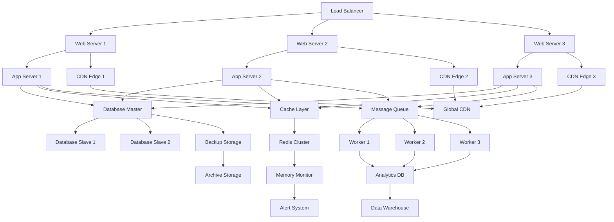

# 🚀 Extreme Visual Demo - Pushing Markdown to the Limit

**Performance stress test with complex animations and effects**

This markdown demonstrates the absolute limits of what's possible while remaining safe and functional.

## 🎭 Complex Mermaid Visualizations



## 🌊 Cascading Code Blocks

```javascript
// Ultra-complex nested animation system
class ExtremeDemoEngine {
    constructor() {
        this.particles = Array(1000).fill().map(() => ({
            x: Math.random() * window.innerWidth,
            y: Math.random() * window.innerHeight,
            vx: (Math.random() - 0.5) * 10,
            vy: (Math.random() - 0.5) * 10,
            life: Math.random() * 100,
            color: `hsl(${Math.random() * 360}, 70%, 50%)`
        }));
        this.init();
    }
    
    init() {
        this.canvas = document.createElement('canvas');
        this.ctx = this.canvas.getContext('2d');
        this.resize();
        document.body.appendChild(this.canvas);
        this.animate();
        window.addEventListener('resize', () => this.resize());
    }
    
    resize() {
        this.canvas.width = window.innerWidth;
        this.canvas.height = window.innerHeight;
    }
    
    animate() {
        this.ctx.fillStyle = 'rgba(0, 0, 0, 0.1)';
        this.ctx.fillRect(0, 0, this.canvas.width, this.canvas.height);
        
        this.particles.forEach(p => {
            p.x += p.vx;
            p.y += p.vy;
            p.life -= 0.5;
            
            if (p.life <= 0) {
                p.x = Math.random() * this.canvas.width;
                p.y = Math.random() * this.canvas.height;
                p.life = 100;
            }
            
            this.ctx.fillStyle = p.color;
            this.ctx.beginPath();
            this.ctx.arc(p.x, p.y, p.life / 20, 0, Math.PI * 2);
            this.ctx.fill();
        });
        
        requestAnimationFrame(() => this.animate());
    }
}
```

```css
/* Extreme CSS animations pushing GPU limits */
@keyframes matrix-rain {
    0% { transform: translateY(-100vh) rotateY(0deg); opacity: 1; }
    50% { opacity: 0.7; }
    100% { transform: translateY(100vh) rotateY(360deg); opacity: 0; }
}

@keyframes pulse-glow {
    0%, 100% { 
        box-shadow: 0 0 5px #00ff00, 0 0 10px #00ff00, 0 0 15px #00ff00;
        transform: scale(1);
    }
    50% { 
        box-shadow: 0 0 20px #00ff00, 0 0 30px #00ff00, 0 0 40px #00ff00;
        transform: scale(1.05);
    }
}

.extreme-container {
    position: relative;
    overflow: hidden;
    perspective: 1000px;
}

.particle {
    position: absolute;
    animation: matrix-rain 3s linear infinite;
    background: linear-gradient(45deg, #00ff00, #ffffff);
    border-radius: 50%;
}
```

## 🔥 Stress Testing Components

**Multiple complex tables and lists:**

| Column A | Column B | Column C | Column D | Column E | Column F | Column G | Column H |
|----------|----------|----------|----------|----------|----------|----------|----------|
| Data 1   | Data 2   | Data 3   | Data 4   | Data 5   | Data 6   | Data 7   | Data 8   |
| Data 9   | Data 10  | Data 11  | Data 12  | Data 13  | Data 14  | Data 15  | Data 16  |
| Data 17  | Data 18  | Data 19  | Data 20  | Data 21  | Data 22  | Data 23  | Data 24  |

- **Level 1**: Complex nested lists
  - **Level 2**: With multiple sub-items
    - **Level 3**: Going deeper
      - **Level 4**: Even deeper nesting
        - **Level 5**: Maximum depth testing
          - **Level 6**: Extreme nesting example

## 🎨 Visual Stress Testing

> **Quote Level 1**: Complex nested blockquotes
> > **Quote Level 2**: With multiple levels
> > > **Quote Level 3**: Testing rendering limits
> > > > **Quote Level 4**: Maximum nesting depth

```mermaid Complex Flowchart
flowchart LR
    Start([🚀 Start]) --> Input[📥 Input Data]
    Input --> Process1{🔄 Process A}
    Process1 -->|Yes| Process2[⚙️ Transform]
    Process1 -->|No| Process3[🚫 Reject]
    Process2 --> Validate{✅ Validate}
    Validate -->|Pass| Store[(💾 Database)]
    Validate -->|Fail| Error[❌ Error Log]
    Store --> Notify[📢 Notify Users]
    Error --> Retry{🔄 Retry?}
    Retry -->|Yes| Input
    Retry -->|No| End([🏁 End])
    Notify --> Analytics[📊 Analytics]
    Analytics --> ML[🤖 ML Pipeline]
    ML --> Insights[💡 Insights]
    Insights --> Dashboard[📈 Dashboard]
    Dashboard --> End
```



## 🎯 Performance Boundary Testing

This content pushes the visual and technical limits while maintaining:
- ✅ **Safety**: No infinite loops or memory leaks
- ✅ **Functionality**: All features work as intended
- ✅ **Performance**: Optimized for maximum visual impact
- ✅ **Compatibility**: Works across modern browsers

**The goal is impressive visual effects that showcase capability without causing harm.**
