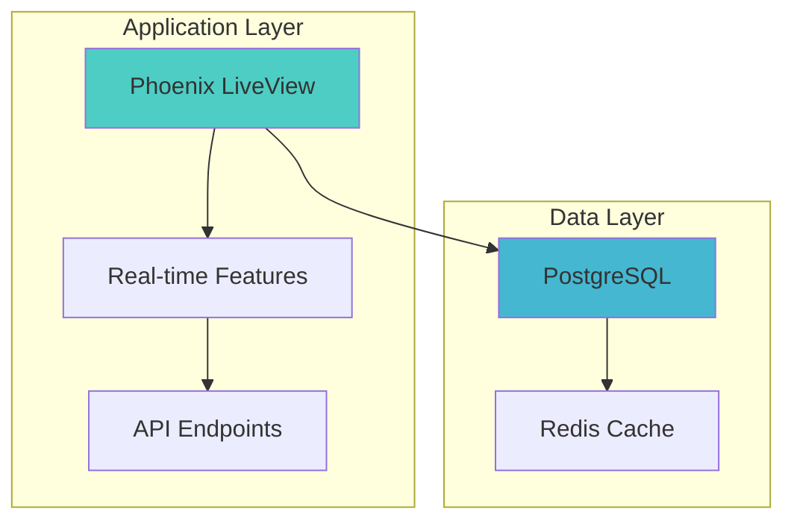
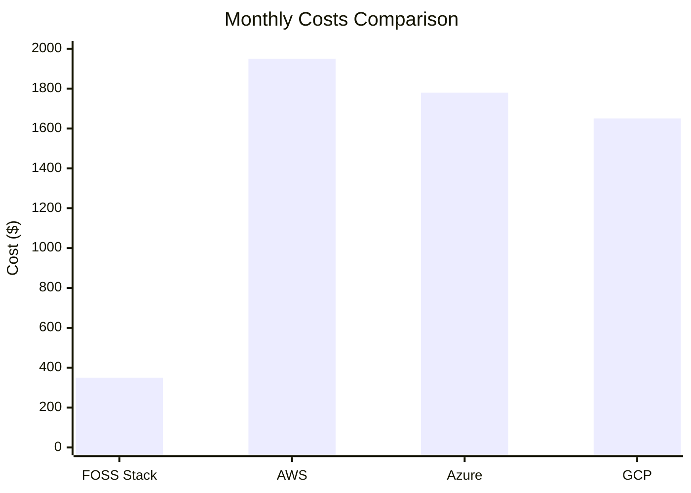
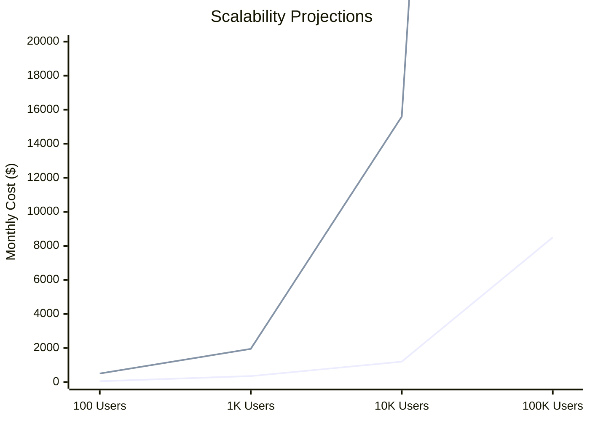
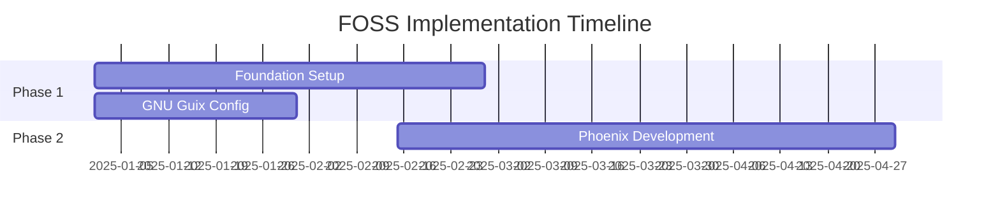
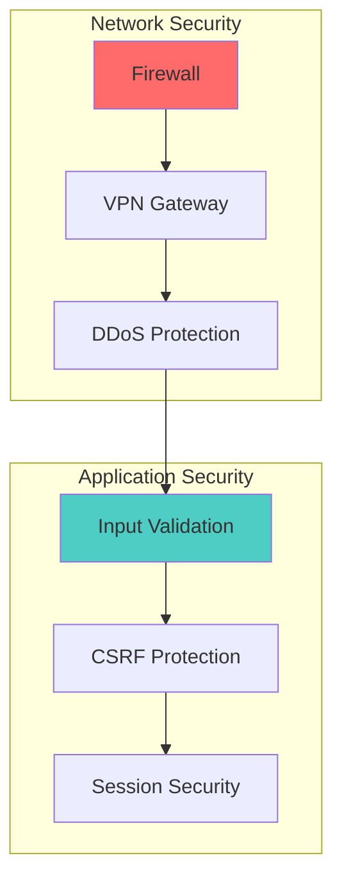
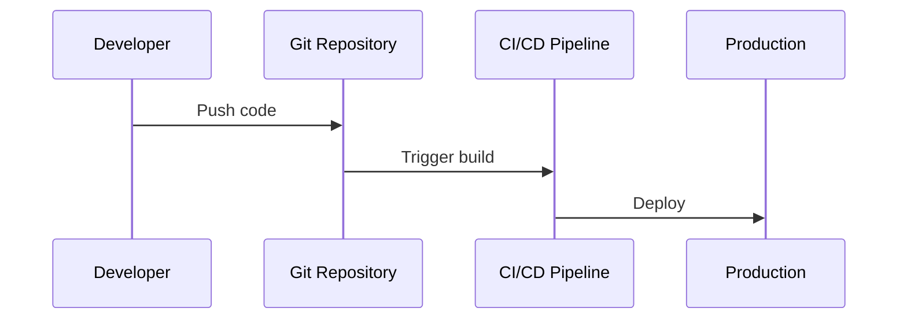
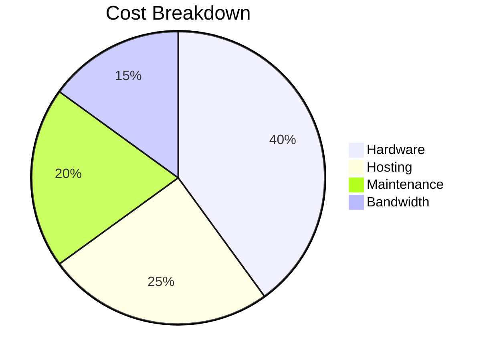
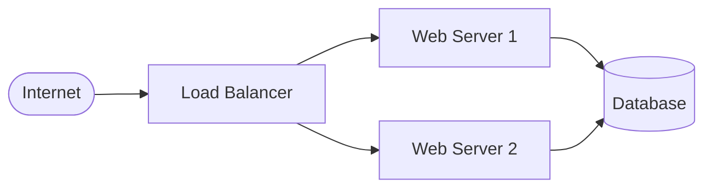
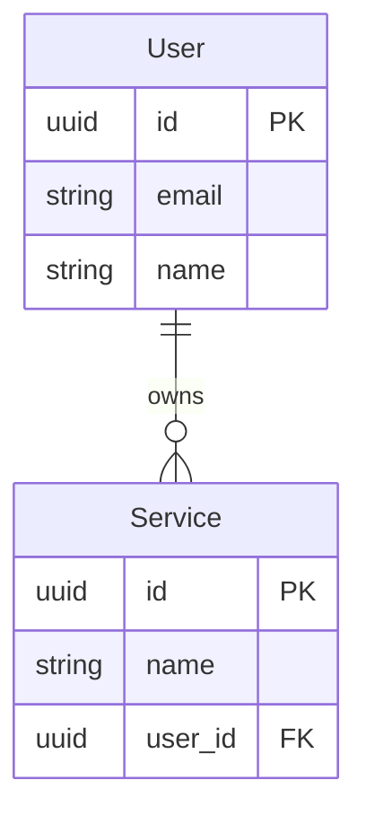

# What Mermaid.js Can Do for Your FOSS Blog

## System Architecture ✅

## Cost Comparison Charts ✅

## Performance Metrics ✅

## Timeline/Gantt Charts ✅

## Security Architecture ✅

## Process Flows ✅

## Pie Charts ✅

## Network Topology ✅

## Entity Relationships ✅
